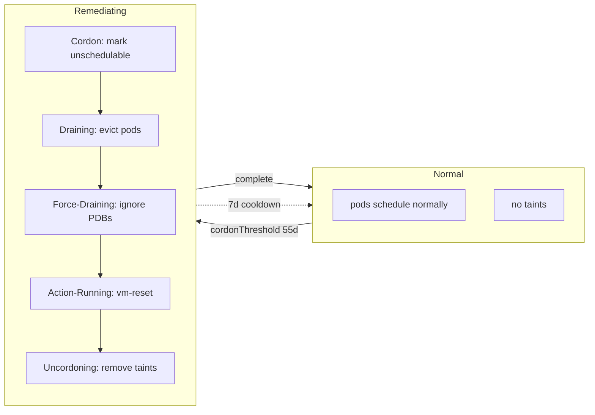

# Crusoe Node Remediation

A Kubernetes CronJob that automatically cordons, drains, and remediates nodes
approaching critical uptime thresholds. Built for Crusoe Managed Kubernetes (CMK)
clusters with nodes affected by the [NVIDIA Blackwell NVLink bug](https://docs.nvidia.com/dgx/dgxb300-fw-update-guide/version-26-03-1.html#gpu-tray-fixes).

---

## TLDR

For **CMK clusters** (uses built-in `crusoe-secrets` from `crusoe-system` namespace — no manual secret creation):

```bash
# 1. Create the namespace
kubectl create namespace crusoe-node-remediation

# 2. Copy the built-in secret to the release namespace (required before install)
kubectl get secret crusoe-secrets -n crusoe-system -o yaml \
  | sed 's/namespace: crusoe-system/namespace: crusoe-node-remediation/' \
  | grep -v '^\s*resourceVersion:\|^\s*uid:\|^\s*creationTimestamp:' \
  | kubectl apply -f -

# 3. Install with Helm (safe defaults — dry-run, 1 node max, no force drain)
helm install crusoe-node-remediation ./helm/crusoe-node-remediation \
  --namespace crusoe-node-remediation

# 4. Watch the logs
kubectl logs -n crusoe-node-remediation -f job/$(kubectl get jobs -n crusoe-node-remediation --sort-by=.metadata.creationTimestamp -o name | tail -1)

# 5. When ready, switch to live mode
helm upgrade crusoe-node-remediation ./helm/crusoe-node-remediation \
  --namespace crusoe-node-remediation \
  --set dryRun=false
```

---

## What It Does

This tool runs as a CronJob and performs the following on each scheduled run:

1. **Discovers** nodes matching your label selector and instance type filter
2. **Queries uptime** via the K8s stats summary API (`node.startTime`)
3. **Cordons** nodes that exceed `cordonThreshold` uptime (marks unschedulable, no drain)
4. **Drains** nodes that exceed `remediationThreshold` uptime (graceful → force)
5. **Executes** the configured remediation action (`vm-reset`, `noop`, etc.)
6. **Uncordons** nodes after successful remediation
7. **Skips** nodes in cooldown (recently remediated) or running this pod

### Safety Features

- **Guardrails** — limits how many nodes can be cordoned simultaneously (absolute or percentage)
- **Self-node exclusion** — never drains the node running the CronJob pod
- **Cooldown** — skips nodes remediated within the cooldown period
- **Max retries** — leaves nodes cordoned for manual intervention after N failed attempts
- **Dry-run mode** — logs all actions without executing cordon/drain/remediation
- **Required affinity** — pod prefers to schedule on nodes not being remediated (avoids remediation phases via `crusoe.ai/remediation.phase` label)
- **Tolerations** — pod tolerates remediation taints as a safety net, so it can still schedule when all nodes are cordoned (otherwise the CronJob would be stuck in Pending)

### Node Lifecycle

The remediation controller uses a two-phase threshold approach. By default,
cordon and remediation thresholds are equal (55d) so action is taken back-to-back
— the node is cordoned and immediately drained + remediated in the same run.
Set a lower `cordonThreshold` if you prefer a buffer window where nodes are
cordoned but not yet drained, allowing workloads to naturally rotate off.



| Phase | Label | Trigger | Action | Taint | Pods |
|-------|-------|---------|--------|-------|------|
| **monitored** | `crusoe.ai/remediation.phase=monitored` | discovered, below threshold | — | none | schedule normally |
| **cordoned** | `crusoe.ai/remediation.phase=cordoned` | uptime ≥ cordonThreshold (55d) | mark unschedulable | `crusoe.ai/remediation.scheduled:NoSchedule` | existing stay, no new |
| **draining** | `crusoe.ai/remediation.phase=draining` | uptime ≥ remediationThreshold (55d) | evict all pods | `crusoe.ai/remediation.draining:NoSchedule` | evicted gracefully |
| **force-draining** | `crusoe.ai/remediation.phase=force-draining` | drain blocked + `forceAfterEvictionFailure: true` | force evict (ignore PDBs) | `crusoe.ai/remediation.draining:NoSchedule` | force-evicted |
| **action-running** | `crusoe.ai/remediation.phase=action-running` | drain complete | vm-reset (reboot VM) | `crusoe.ai/remediation.maintenance:NoSchedule` | VM rebooting |
| **uncordoning** | `crusoe.ai/remediation.phase=uncordoning` | action + boot verified | remove taints, mark schedulable | removing: `maintenance` + `scheduled` | schedule normally |

> **Note:** Thresholds are examples for the NVIDIA Blackwell NVLink bug. Your mileage
> may vary — tune `cordonThreshold`, `remediationThreshold`, and `remediationCooldown`
> for your cluster's workload and hardware. When `cordonThreshold` ==
> `remediationThreshold`, cordon and drain happen back-to-back. Set a lower
> `cordonThreshold` to create a buffer window for gradual workload rotation.

---

## Getting Started

### Prerequisites

- Helm 3.x
- `kubectl` with cluster admin access
- **For CMK clusters (default):** Nothing else needed — `crusoe-secrets` is auto-provisioned
- **For custom/non-CMK clusters:** Crusoe API credentials (access key + secret key)
- **Optional:** Crusoe Container Registry access if using private images

### Step 1: Setup

**For CMK clusters (most users):**

```bash
# Create the namespace first
kubectl create namespace crusoe-node-remediation

# Copy the built-in secret from crusoe-system to the release namespace
kubectl get secret crusoe-secrets -n crusoe-system -o yaml \
  | sed 's/namespace: crusoe-system/namespace: crusoe-node-remediation/' \
  | grep -v '^\s*resourceVersion:\|^\s*uid:\|^\s*creationTimestamp:' \
  | kubectl apply -f -
```

**For custom/non-CMK clusters:**

```bash
# Create namespace
kubectl create namespace crusoe-node-remediation

# Create API credentials secret
kubectl create secret generic crusoe-api-credentials \
  --namespace crusoe-node-remediation \
  --from-literal=access-key=YOUR_ACCESS_KEY \
  --from-literal=secret-key=YOUR_SECRET_KEY \
  --from-literal=api-url=https://api.cloud.crusoe.ai/v1alpha5
```

**Optional: Image pull secret (if using private registry):**

```bash
kubectl create secret docker-registry crusoe-registry-pull \
  --namespace crusoe-node-remediation \
  --docker-server=registry.YOUR-LOCATION.ccr.crusoecloudcompute.com \
  --docker-username=YOUR_EMAIL@crusoe.ai \
  --docker-password=YOUR_REGISTRY_TOKEN
```

### Step 2: Create values.yaml

```yaml
image:
  repository: registry.YOUR-LOCATION.ccr.crusoecloudcompute.com/crusoe-node-remediation.YOUR-PROJECT-ID/crusoe-node-remediation
  tag: v0.0.23
  pullPolicy: IfNotPresent

imagePullSecret: crusoe-registry-pull

# Target nodes (optional — leave empty for all nodes)
nodeSelector:
  matchLabels:
    # crusoe.ai/project.id: "YOUR-PROJECT-ID"

instanceTypeFilter: "b200.*"

# NVIDIA Blackwell NVLink bug thresholds
# Equal thresholds = cordon + drain back-to-back.
# Set a lower cordonThreshold for a buffer window.
cordonThreshold: 55d
remediationThreshold: 55d
remediationCooldown: 7d

action:
  type: vm-reset
  timeout: 30m
  maxRetries: 5

drainTimeout: 120m
forceAfterEvictionFailure: false

# Built-in secret (default for CMK)
useBuiltinSecret: true

# Start in observation mode
dryRun: true

schedule: "0 0 * * *"   # daily at midnight
```

### Step 3: Deploy in Observation Mode

```bash
helm install crusoe-node-remediation ./helm/crusoe-node-remediation \
  --namespace crusoe-node-remediation \
  -f values.yaml
```

Check the logs:
```bash
kubectl logs -n crusoe-node-remediation -f job/$(kubectl get jobs -n crusoe-node-remediation --sort-by=.metadata.creationTimestamp -o name | tail -1)
```

You'll see output like:
```
config: thresholds=(cordon=55d, remediation=55d, cooldown=7d), action=(type=vm-reset, dryRun=true), guardrails=(global=1, perPool=1), drain=(timeout=120m, force=false)
cluster: 458 nodes (450 ready, 3 notReady, 0 remediating)
discovered 12 nodepools, 200 targeted nodes
targeting: crusoe.ai/project.id=YOUR-PROJECT-ID, beta.kubernetes.io/instance-type=~b200.*
guardrails: 0 remediating / 1 max
[dry-run] would remediate node node-gpu-42 with action vm-reset (uptime 60d12h)
[dry-run] would remediate node node-gpu-17 with action vm-reset (uptime 60d5h)
```

### Step 4: Progressively Enable

Follow this safe progression:

| Phase | Config | What happens |
|-------|--------|-------------|
| **1. Observe** | `dryRun: true` | Logs what *would* happen — no changes to nodes |
| **2. Cordon only** | `dryRun: false`, `action: noop` | Cordons + drains + uncordons — no VM actions |
| **3. Remediate** | `dryRun: false`, `action: vm-reset` | Full cycle: cordon → drain → VM reset → uncordon |

#### Phase 1: Observe (days 1-2)

Keep `dryRun: true`. Verify:
- Correct nodes are discovered
- Uptime values look correct
- Guardrail limits are appropriate
- No unexpected nodes targeted

#### Phase 2: Cordon + Drain (days 3-5)

```bash
helm upgrade crusoe-node-remediation ./helm/crusoe-node-remediation \
  --namespace crusoe-node-remediation \
  -f values.yaml \
  --set dryRun=false \
  --set action.type=noop
```

This does everything except the VM action:
- Cordons the node (marks unschedulable)
- Drains pods (graceful → force if needed)
- Runs noop (does nothing)
- Uncordons the node (back to schedulable)

Verify:
- Drain succeeds (check `kubectl get events -n default`)
- Pods reschedule correctly
- Nodes come back to Ready after uncordon
- Guardrails prevent too many nodes being drained at once

#### Phase 3: Full Remediation (day 6+)

```bash
helm upgrade crusoe-node-remediation ./helm/crusoe-node-remediation \
  --namespace crusoe-node-remediation \
  -f values.yaml \
  --set dryRun=false \
  --set action.type=vm-reset
```

This does the full cycle:
- Cordon → Drain → VM reset via Crusoe API → Wait for node Ready → Uncordon

Verify:
- VM reset succeeds (check `kubectl get events -n default` for `NodeRemediated`)
- `bootID` changes after reset (confirms reboot)
- Node comes back Ready
- Uptime resets to near-zero after reboot

---

## Configuration

See [docs/configuration.md](docs/configuration.md) for the full reference.

### Key Settings

| Setting | Default | Description |
|--------|---------|-------------|
| `dryRun` | `true` | Log only, don't touch nodes |
| `cordonThreshold` | `55d` | Uptime at which to cordon |
| `remediationThreshold` | `55d` | Uptime at which to remediate |
| `remediationCooldown` | `7d` | Skip nodes remediated within this period |
| `action.type` | `vm-reset` | Remediation action (`vm-reset`, `vm-stop`, `vm-start`, `vm-delete`, `noop`) |
| `action.maxRetries` | `5` | Max attempts before leaving cordoned for manual intervention |
| `guardrails.globalMaxCordoned` | `1` | Max nodes being remediated cluster-wide |
| `guardrails.perPoolMaxCordoned` | `1` | Max nodes being remediated per nodepool |
| `drainTimeout` | `120m` | Graceful drain timeout |
| `forceAfterEvictionFailure` | `false` | Bypass PDBs and delete emptyDir data if [eviction](https://kubernetes.io/docs/concepts/scheduling-eviction/api-eviction/) fails |
| `schedule` | `0 0 * * *` | Cron schedule (daily at midnight) |
| `instanceTypeFilter` | `b200.*` | Regex filter for `beta.kubernetes.io/instance-type` label |
| `useBuiltinSecret` | `true` | Use built-in `crusoe-secrets` from `crusoe-system` namespace |

### Conservative Starting Point

For production with minimal risk, start with:

```yaml
guardrails:
  globalMaxCordoned: 1        # only 1 node at a time
  perPoolMaxCordoned: 1

drainTimeout: 15m             # be patient with drain
forceAfterEvictionFailure: false             # don't force — leave cordoned if drain fails

action:
  type: vm-reset
  maxRetries: 2               # fewer retries = faster manual intervention

remediationCooldown: 14d      # long cooldown — don't re-remediate quickly
```

### Tuning the Schedule

The CronJob schedule determines how frequently the tool scans for nodes needing remediation.
Choose a cadence that allows the **longest drain** in your cluster to complete **within a single run**
— otherwise overlapping runs are blocked by `concurrencyPolicy: Forbid` and nodes may pile up.

**Key factors:**

| Factor | How it affects schedule |
|--------|----------------------|
| `drainTimeout` | The tool waits up to this long for graceful drain. Schedule must be ≥ `drainTimeout` + action timeout + buffer. |
| Pod graceful termination | Long `terminationGracePeriodSeconds` on workloads extends drain time. |
| PDB quorum | If PDBs block eviction, drain stalls until `drainTimeout` — then force drain kicks in. |
| `action.timeout` | VM reset/stop/start polling adds to total run time. |
| Number of nodes | With `globalMaxCordoned: 1`, each node is processed sequentially. More nodes = longer total run. |

**Suggested cadences:**

| Workload profile | Schedule | Rationale |
|------------------|----------|----------|
| Fast-draining (stateless, low PDB impact) | `0 * * * *` (every hour) | Drain completes in minutes; hourly is responsive enough |
| Moderate (mixed stateless/stateful, PDBs) | `0 */2 * * *` (every 2h) | Allows 10–15m drain + 30m action + buffer within one run |
| Slow-draining (large stateful, long grace periods) | `0 */4 * * *` (every 4h) | Accommodates 30m+ drain, long VM reset polling, and cooldown between nodes |
| Conservative / low-urgency | `0 */6 * * *` (every 6h) | For 60-day thresholds — 6h granularity is plenty; minimizes API noise |

**Rule of thumb:**

> `schedule interval ≥ drainTimeout + action.timeout + (globalMaxCordoned × per-node overhead)`
>
> Where per-node overhead ≈ 2–5 min for cordon/uncordon/label updates.

**Example:** If `drainTimeout: 15m`, `action.timeout: 30m`, `globalMaxCordoned: 1`:
>
> Minimum interval ≈ 15m + 30m + 5m = 50m → round up to **every hour** (`0 * * * *`).

If you have many nodes to process in a single run (e.g., 5+ at `globalMaxCordoned: 5`),
multiply the per-node cost and widen the interval accordingly.

### Tuning Guardrails

Guardrails can be absolute count, percentage, or both (more restrictive wins):

```yaml
guardrails:
  globalMaxCordoned: 5            # max 5 nodes cluster-wide
  globalMaxCordonedPercent: 10    # OR 10% of cluster (whichever is smaller)
  perPoolMaxCordoned: 2           # max 2 nodes per nodepool
  perPoolMaxCordonedPercent: 25   # OR 25% of pool (whichever is smaller)
```

The logs show the calculation:
```
guardrails: 2 remediating / 3 max
guardrail config: globalMax=5, globalMaxPercent=10% (→3 of 30), perPoolMax=2
```

---

## Monitoring

### Logs

```bash
# Latest job logs
kubectl logs -n crusoe-node-remediation -f job/$(kubectl get jobs -n crusoe-node-remediation --sort-by=.metadata.creationTimestamp -o name | tail -1)
```

### Remediation Reports

When `remediationReport: true` (default), the CronJob writes a `RemediationReport`
custom resource per nodepool after each run, giving you a quick `kubectl`-native
status overview without parsing logs.

```bash
# List all nodepool reports
kubectl get remediationreport -n crusoe-node-remediation

# Watch reports update in real time
kubectl get remediationreport -n crusoe-node-remediation -w

# Full detail for a specific nodepool
kubectl get remediationreport -n crusoe-node-remediation NODEPOOL_ID -o yaml
```

Example output:

```
NAME        LAST RUN              STATUS     TOTAL  READY  REMEDIATING  PENDING  COOLDOWN  MONITORED
0fe3d21c    2026-08-20T00:05:00Z  succeeded  8      7      1            0        2         4
a1b2c3d4    2026-08-20T00:05:00Z  succeeded  4      4      0            0        0         4
```

| Column | Description |
|--------|-------------|
| **Last Run** | Timestamp of the most recent CronJob run |
| **Status** | `succeeded` or `failed` |
| **Total** | Total nodes in the nodepool |
| **Ready** | Nodes in `Ready` condition |
| **Remediating** | Nodes in an active remediation phase (cordoned, draining, action-running, etc.) |
| **Pending** | Nodes cordoned and waiting for `remediationThreshold` |
| **Cooldown** | Nodes recently remediated, in cooldown |
| **Monitored** | Healthy managed nodes below cordon threshold |

> **Note:** The CRD is deployed automatically when `remediationReport: true`. Set
> `remediationReport: false` in your Helm values to skip CRD creation and report writing.

#### How Reports Update

Reports are written **progressively** during each run, not just at the end:

1. **Start of run** — all pool CRs are created/updated with `status=running` and zeroed counts
2. **After each nodepool** — that pool's CR is updated with real counts (nodes evaluated, guardrails checked, actions taken)
3. **End of run** — all CRs updated with final `status=succeeded` or `status=failed`

This means `kubectl get remediationreport -w` shows pools updating one at a time as the run progresses.

#### Serial Processing

Remediation runs **serially** — one nodepool at a time, and within each pool, one node at a time. With the default guardrail (`globalMaxCordoned: 1`), only a single node is remediated cluster-wide at any moment. The full cycle for each node is:

```
cordon → drain → VM action → wait for Ready → uncordon
```

Only after one node completes does the next begin. This is by design — it minimizes workload disruption. The trade-off is that large clusters take longer: with 10 nodes to remediate and a 15m drain + 30m action per node, a single run can take 7+ hours. See [Tuning the Schedule](#tuning-the-schedule) for guidance on matching your cron interval to your drain + action times.

### K8s Events

Node events are created in the `default` namespace:

```bash
kubectl get events -n default --sort-by='.lastTimestamp' | grep -E "NodeCordoned|NodeRemediated|DrainBlocked|ForceDrainFailed|MaxRetriesExceeded"
```

| Event | Type | Description |
|-------|------|-------------|
| `NodeCordoned` | Normal | Node marked unschedulable |
| `DrainBlocked` | Warning | Graceful drain failed (PDB, local storage) |
| `ForceDrainFailed` | Warning | Force drain also failed |
| `NodeRemediated` | Normal | Full cycle completed successfully |
| `NodeUncordoned` | Normal | Node back to schedulable |
| `MaxRetriesExceeded` | Warning | Node left cordoned — manual intervention needed |

### Node Labels & Annotations

```bash
# Check remediation state
kubectl get nodes -o custom-columns='NAME:.metadata.name,PHASE:.metadata.labels.crusoe\.ai/remediation\.phase,CORDONED:.spec.unschedulable'

# Check annotations
kubectl get node NODE_NAME -o jsonpath='{.metadata.annotations}' | jq | grep crusoe
```

| Label/Annotation | Description |
|------------------|-------------|
| `crusoe.ai/remediation.managed=true` | Node is managed by this tool |
| `crusoe.ai/remediation.phase` | Current phase: `cordoned`, `draining`, `force-draining`, `action-running`, `uncordoning`, `monitored` |
| `crusoe.ai/remediation.action-completed-at` | Timestamp of last successful remediation (used for cooldown) |
| `crusoe.ai/remediation.attempt` | Current retry count (reset to 0 on success) |
| `crusoe.ai/remediation.cordoned-at` | When the node was cordoned |
| `crusoe.ai/remediation.drain-started-at` | When drain started |
| `crusoe.ai/remediation.last-action` | Last action taken (`cordon`, `noop-complete`, `vm-reset-complete`, etc.) |

---

## Remediation Actions

| Action | Description | Use case |
|--------|-------------|----------|
| `vm-reset` | Crusoe API VM RESET + poll node Ready | **Default** — reboots the VM in-place |
| `vm-stop` | Crusoe API VM STOP + poll VM stopped | Stop a node without deleting |
| `vm-start` | Crusoe API VM START + poll node Ready | Start a stopped node |
| `vm-delete` | Crusoe API VM DELETE + wait for replacement | Replace a node (CMK auto-provisions new) |
| `noop` | No action | Testing — exercises cordon/drain/uncordon only |

### Multi-step Actions

```yaml
action:
  maxRetries: 3
  steps:
    - type: vm-stop
      timeout: 5m
    - type: vm-delete
      timeout: 30m
      wait: 2m    # wait 2m after this step before the next
```

---

## Drain Behavior

The tool follows [`kubectl drain`](https://kubernetes.io/docs/reference/generated/kubectl/kubectl-commands/#drain) semantics using the same `k8s.io/kubectl/pkg/drain` package. See the K8s docs on [safely draining a node](https://kubernetes.io/docs/tasks/administer-cluster/safely-drain-node/) and [API-initiated eviction](https://kubernetes.io/docs/concepts/scheduling-eviction/api-eviction/) for background.

### Phase 1: Eviction (graceful)

Uses the [eviction API](https://kubernetes.io/docs/concepts/scheduling-eviction/api-eviction/) to evict pods, respecting [PodDisruptionBudgets](https://kubernetes.io/docs/tasks/run-application/configure-pod-disruption-budget/) and each pod's `terminationGracePeriodSeconds`. DaemonSet pods are skipped (`--ignore-daemonsets`).

### Phase 2: Force eviction (fallback)

Only runs if Phase 1 fails **and** `forceAfterEvictionFailure: true`. Retries with `Force=true` (bypasses PDBs) and `DeleteEmptyDirData=true` (deletes emptyDir data). The eviction API is still used — this ensures DaemonSet pods are properly skipped rather than causing delete errors.

```
Phase 1: Eviction (respects PDBs, graceful termination)
  ├── succeeds → continue to remediation action
  └── fails
      ├── forceAfterEvictionFailure: true  → Phase 2: Force eviction (bypass PDBs, delete emptyDir)
      │   ├── succeeds → continue to remediation action
      │   └── fails → leave cordoned, return error
      └── forceAfterEvictionFailure: false → leave cordoned, return error
```

---

## Cleanup

Remove the tool and restore all nodes:

```bash
# Uninstall Helm chart
helm uninstall crusoe-node-remediation -n crusoe-node-remediation

# Uncordon all managed nodes and remove labels/taints
for node in $(kubectl get nodes -o jsonpath='{.items[*].metadata.name}'); do
  kubectl uncordon "$node"
  kubectl label node "$node" crusoe.ai/remediation.managed-
  kubectl label node "$node" crusoe.ai/remediation.phase-
  kubectl taint node "$node" crusoe.ai/remediation.scheduled:NoSchedule-
  kubectl taint node "$node" crusoe.ai/remediation.draining:NoSchedule-
  kubectl taint node "$node" crusoe.ai/remediation.maintenance:NoSchedule-
done

# Delete namespace
kubectl delete namespace crusoe-node-remediation
```

---

## Building & Testing

```bash
# Build binary
make build

# Run tests
make test

# Build and push Docker image
make docker-build IMAGE_TAG=v0.0.23
make docker-push IMAGE_TAG=v0.0.23

# Validate config
./crusoe-node-remediation --validate
```

---

## Architecture

```
┌─────────────────────────────────────────────────────────────┐
│                     CronJob (every N min)                    │
│                                                              │
│  1. Discover nodes (label selector + instance type filter)  │
│  2. Query uptime (K8s stats summary API)                     │
│  3. Sort by highest uptime (closest to threshold first)      │
│  4. Check guardrails (global + per-pool limits)              │
│  5. For each eligible node:                                  │
│     a. Cordon (mark unschedulable)                           │
│     b. Drain (evict pods, skip DaemonSets)                   │
│     c. Execute action (vm-reset, noop, etc.)                │
│     d. Uncordon (back to schedulable)                        │
│     e. Set cooldown annotation                               │
│  6. Skip nodes in cooldown, at max retries, or running self  │
│                                                              │
│  Safety: self-node exclusion, guardrails, cooldown, retries  │
└─────────────────────────────────────────────────────────────┘
```

---

## RBAC

The tool requires these permissions:

| Resource | Verbs | Why |
|----------|-------|-----|
| `nodes` | get, list, watch, update, patch | Cordon/uncordon, labels, annotations |
| `nodes/proxy` | get | Stats summary API for uptime |
| `pods` | get, list, delete | Drain (evict pods) |
| `pods/eviction` | create | Drain (eviction API) |
| `daemonsets` (apps) | get, list | Drain (skip DaemonSet pods) |
| `poddisruptionbudgets` (policy) | get, list | Drain (check PDBs) |
| `events` | create, patch | Emit K8s events |

---

## FAQ

### Is it safe to run in production?

Yes — start with `dryRun: true` (the default) and `globalMaxCordoned: 1` (also the default). You'll only observe what would happen. Progress to `noop` action to test cordon/drain/uncordon, then to `vm-reset` for full remediation.

### What happens if drain fails?

If `forceAfterEvictionFailure: true`, the tool retries the [eviction](https://kubernetes.io/docs/concepts/scheduling-eviction/api-eviction/) with `Force=true` (bypasses [PDBs](https://kubernetes.io/docs/tasks/run-application/configure-pod-disruption-budget/)) and `DeleteEmptyDirData=true` (deletes emptyDir data). If force eviction also fails, the node is left cordoned and the error is logged. The next cron run will retry (up to `maxRetries`). See [safely draining a node](https://kubernetes.io/docs/tasks/administer-cluster/safely-drain-node/) for K8s drain background.

### What happens after max retries?

The node is left cordoned with a `MaxRetriesExceeded` event. It will not be retried automatically. You need to manually uncordon it or investigate the issue.

### Can I target specific nodepools?

Yes — add `crusoe.ai/nodepool.id` to your `nodeSelector.matchLabels`:

```yaml
nodeSelector:
  matchLabels:
    crusoe.ai/project.id: "YOUR-PROJECT-ID"
    crusoe.ai/nodepool.id: "YOUR-NODEPOOL-ID"
```

### How does cooldown work?

After successful remediation, the `crusoe.ai/remediation.action-completed-at` annotation is set to the current time. The node is skipped on subsequent runs until `now - action-completed-at > remediationCooldown`.

### What if all nodes are cordoned?

The CronJob pod has tolerations for remediation taints and `node.kubernetes.io/unschedulable`, so it can still schedule on cordoned nodes. It also has required affinity to avoid nodes being actively remediated.

---

## Disclaimer

This solution is provided **AS IS, WITHOUT WARRANTY OF ANY KIND**, express or implied, including but not limited to the warranties of merchantability, fitness for a particular purpose, and noninfringement. The CronJob, Go source code, Helm chart, scripts, and documentation in this directory are reference implementations intended to help you get started — they are not a supported Crusoe product and may not be appropriate for every deployment without customization. This tool performs automated node cordon, drain, and VM reset actions that can disrupt running workloads; carefully review the configuration and test in `dryRun` mode before applying it to production clusters. Use at your own risk.

Customers are encouraged to **fork this repository** and adapt the solution to their specific operational requirements, workload characteristics, and cluster configurations. Crusoe does not assume liability for data loss, workload disruption, or other damages arising from the use of this software.
