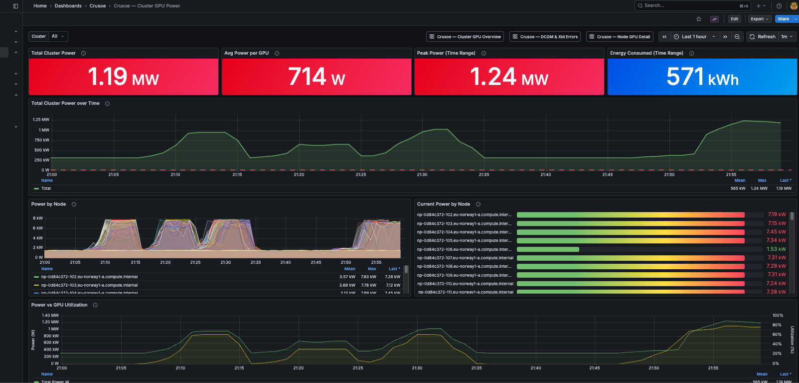

<!--
  Licensed under the terms of the parent repository. See the LICENSE file in
  the root of crusoecloud/solutions-library for details.
-->

# Self-hosted Grafana on Crusoe Managed Kubernetes



This solution deploys Grafana on a Crusoe Managed Kubernetes (CMK) cluster and configures it to pull GPU, node, storage, and Slurm metrics from the Crusoe Metrics endpoint. You get a persistent Grafana instance you control, with pre-built dashboards for GPU utilization, per-node GPU detail, DCGM/Xid error tracking, GPU power, InfiniBand fabric activity, Crusoe Shared Storage health, and Slurm cluster state.

What this is: a self-managed Grafana deployment best suited for teams that want dedicated dashboards for CMK or Managed Slurm workloads. Support is best-effort. For fully managed observability, the metrics are also available in Crusoe Command Center without any setup.

What this is not: a full observability stack. Crusoe Metrics currently exposes infrastructure and GPU metrics only — logs and distributed traces are not available through this endpoint. Sub-minute scrape intervals are not supported. See [Limitations](#limitations-and-next-steps) for details.

---

## Architecture

```
  CMK / Managed Slurm Cluster
  ┌────────────────────────────────────────────────────────┐
  │                                                        │
  │  ┌──────────┐     ┌───────────────────────────────┐   │
  │  │  Nodes   │────▶│  Crusoe Watch Agent (DaemonSet)│   │
  │  └──────────┘     └───────────────┬───────────────┘   │
  └───────────────────────────────────┼────────────────────┘
                                      │ collects metrics
                                      ▼
                        ┌─────────────────────────┐
                        │  Crusoe Metrics Backend  │
                        │  (30-day retention)      │
                        └────────────┬────────────┘
                                     │
                                     │ Prometheus-compatible query API
                                     ▼
                        ┌────────────────────────────────────┐
                        │  Crusoe Metrics Endpoint          │
                        │  api.crusoecloud.com/v1alpha5/...  │
                        │  .../metrics/timeseries            │
                        └────────────▲───────────────────────┘
                                     │ Bearer token (injected by Caddy)
                                     │
  monitoring namespace (CMK)         │
  ┌───────────────────────────────── │ ──────────────────────┐
  │                                  │                       │
  │  ┌──────────────────────────────────────────────────┐   │
  │  │  Grafana pod                                      │   │
  │  │  ┌────────────┐  http://localhost:8888           │   │
  │  │  │  Grafana   │ ───────▶  ┌──────────────────┐   │   │
  │  │  │  (12.x)    │           │ crusoe-auth-proxy │───┼───┘
  │  │  │            │           │   (Caddy)        │   │
  │  │  └────────────┘           │  reads token +   │   │
  │  │   ▲                       │  project from    │   │
  │  │   │ sidecar-              │  Secret env vars │   │
  │  │   │ provisioned           └──────────────────┘   │
  │  │   │ dashboards + datasource (no secret in DS)    │
  │  │   │                                              │
  │  │  ┌─┴─────────────────────────────────┐           │
  │  │  │ grafana-sc-dashboard +            │           │
  │  │  │ grafana-sc-datasources sidecars   │           │
  │  │  └───────────────────────────────────┘           │
  │  │   PVC: /var/lib/grafana                          │
  │  └──────────────────────────────────────────────────┘
  │           │                                            │
  │  ┌────────▼─────────┐                                 │
  │  │  grafana-lb Svc  │                                 │
  │  │  (LoadBalancer)  │                                 │
  └──┴────────┬─────────┴─────────────────────────────────┘
              │ :3000
              ▼
         User Browser
```

---

## Prerequisites

- A running CMK cluster. Verify you can reach it:
  ```bash
  kubectl get nodes
  ```
- `helm` (v3 or v4) installed:
  ```bash
  helm version
  ```
- `crusoe` CLI installed and authenticated:
  ```bash
  crusoe projects list
  ```
- **Crusoe Metrics enabled on your project.** This feature is now GA and installed on all CMK clusters by default. If you wish to query metrics from standalone VMs, you will have to opt in to include the metrics agent during VM creation. 
- **Crusoe Watch Agent installed on the cluster.** The Watch Agent collects infrastructure and DCGM metrics and forwards them to the Crusoe Metrics backend. It is installed by default on Managed Slurm clusters. For CMK clusters, verify with your account team or check for the agent DaemonSet:
  ```bash
  kubectl get daemonset -A | grep -i watch
  ```


---

## Step 1: Generate the monitoring token

Get your project ID:

```bash
crusoe projects list
```

Note the `ID` column value for the project you want to monitor. Then create a monitoring token:

```bash
crusoe monitoring tokens create
```

**Copy the token immediately.** It is shown only once and cannot be retrieved afterward.

---

## Step 2: Create the namespace and secret

Apply the namespace:

```bash
kubectl apply -f manifests/namespace.yaml
```

Copy the secret example and fill in your values:

```bash
cp manifests/monitoring-token-secret.yaml.example manifests/monitoring-token-secret.yaml
```

Edit `manifests/monitoring-token-secret.yaml` and replace the placeholder values:

```yaml
stringData:
  MONITORING_TOKEN: "<paste your monitoring token here>"
  PROJECT_ID: "<paste your project ID here>"
```

Apply the secret:

```bash
kubectl apply -f manifests/monitoring-token-secret.yaml
```

> `monitoring-token-secret.yaml` is listed in `.gitignore` — do not commit it. Use the `.example` file as the committed template.

---

## Step 3: Apply the remaining manifests and install Grafana

Apply the StorageClass (if not already present), the PVC, the dashboards ConfigMap, and the datasource ConfigMap:

```bash
kubectl apply -f manifests/ssd-storageclass.yaml
kubectl apply -f manifests/grafana-pvc.yaml
kubectl apply -f manifests/grafana-dashboards-configmap.yaml
kubectl apply -f manifests/grafana-datasource-configmap.yaml
```

> The datasource ConfigMap contains no secrets — it points Grafana at `http://localhost:8888`, which is the in-pod auth-injecting sidecar (`crusoe-auth-proxy`) defined in `grafana-values.yaml`. The sidecar reads `MONITORING_TOKEN` and `PROJECT_ID` from the Secret you applied in Step 2 and rewrites every outbound request to the Crusoe Metrics endpoint with the right `Authorization: Bearer …` header. 

Add the Grafana Helm repository and install:

```bash
helm repo add grafana https://grafana.github.io/helm-charts
helm repo update

helm install grafana grafana/grafana \
  --namespace monitoring \
  --values manifests/grafana-values.yaml
```

What `grafana-values.yaml` configures:

| Setting | Value | Why |
|---|---|---|
| `persistence.existingClaim` | `grafana-storage` | Uses the PVC created above; data survives pod restarts |
| `deploymentStrategy.type` | `Recreate` | Required for `ReadWriteOnce` PVCs — rolling updates deadlock because the new pod can't attach the same volume |
| `sidecar.datasources.enabled` | `true` | Watches ConfigMaps and Secrets labeled `grafana_datasource=1` and auto-provisions them |
| `sidecar.dashboards.enabled` | `true` | Watches ConfigMaps labeled `grafana_dashboard=1` and loads them into Grafana |
| `sidecar.dashboards.provider.folder` | `Crusoe` | Puts provisioned dashboards in a "Crusoe" folder in the Grafana UI |
| `service.type` | `ClusterIP` | External access handled separately by `grafana-service-lb.yaml` |
| `extraContainers.crusoe-auth-proxy` | Caddy on `:8888` | Injects `Authorization: Bearer $MONITORING_TOKEN` into outbound requests to Crusoe Metrics. Reads token + project from the `crusoe-monitoring-token` Secret as env vars. Avoids Grafana 12.3.x's `secureJsonData` regression. |
| `resources.limits.memory` | `2Gi` | Rendering many dashboards against a multi-thousand-series cluster OOMs at the chart default (512Mi) |

Wait for the pod to be ready:

```bash
kubectl rollout status deployment/grafana -n monitoring
```

---

## Step 4: Expose via LoadBalancer

Apply the LoadBalancer service:

```bash
kubectl apply -f manifests/grafana-service-lb.yaml
```

Wait for an external IP to be assigned (this can take 1–2 minutes on Crusoe):

```bash
kubectl get svc grafana-lb -n monitoring -w
```

Once `EXTERNAL-IP` shows an IP address, Grafana is accessible at `http://<EXTERNAL-IP>:3000`.

> **Why port 3000 and not 80?** The Grafana Helm chart's ClusterIP service ends up on port 3000 on Crusoe Managed Kubernetes regardless of the `service.port` value passed in `grafana-values.yaml`, so this repo's `grafana-service-lb.yaml` exposes 3000 to match. If you need port 80 externally, add an ingress controller (recommended for production anyway).

> **Security warning:** This service exposes Grafana directly to the public internet on port 3000 with no TLS. For production use, add an ingress controller with TLS termination and an authentication proxy (e.g. [oauth2-proxy](https://oauth2-proxy.github.io/oauth2-proxy/)). At minimum, restrict the LoadBalancer source ranges in `grafana-service-lb.yaml` to your IP range:
> ```yaml
> spec:
>   loadBalancerSourceRanges:
>     - "203.0.113.0/24"   # replace with your CIDR
> ```
>
> For a quick local test without a public IP, skip the LoadBalancer and use port-forward instead:
> ```bash
> kubectl port-forward -n monitoring svc/grafana 3000:3000
> # Then open http://localhost:3000
> ```

---

## Step 5: Log in and verify

Retrieve the auto-generated admin password:

```bash
kubectl get secret --namespace monitoring grafana \
  -o jsonpath="{.data.admin-password}" | base64 --decode; echo
```

Log in at `http://<EXTERNAL-IP>:3000` (or `http://localhost:3000` if using port-forward) with username `admin` and the password above. Change the password after first login.

Verify the data source:

1. Click **Connections** → **Data sources** in the left sidebar.
2. Click **Crusoe Metrics**.
3. Scroll to the bottom and click **Save & test**.
4. You should see a green banner: *"Successfully queried the Prometheus API."*

If you see anything else, see [Troubleshooting](#troubleshooting).

Verify the dashboards:

1. Click **Dashboards** in the left sidebar.
2. Open the **Crusoe** folder.
3. You should see ten dashboards: Cluster GPU Overview, Node GPU Detail, DCGM & Xid Errors, Cluster GPU Power, InfiniBand Cluster View, InfiniBand Node View, Shared Storage View, Slurm Cluster View, Network Cluster View, and Node Network Detail.

---

## Dashboards included

All dashboards live in the `Crusoe` folder in Grafana. Most have a **Cluster** dropdown populated from `cluster_id` (GPU, IB, and Slurm dashboards each source it from their own primary metric so the dropdown only lists clusters that actually publish that family). Per-node and per-HCA dashboards add a **Node** dropdown; the Shared Storage View uses a single **Crusoe SDisk** dropdown instead because Crusoe block-storage disks are project-scoped, not cluster-scoped.

### GPU dashboards

**Cluster GPU Overview (`cluster-gpu-overview.json`, 13 panels)** — cluster-wide GPU health, utilization, and thermals.

- **Utilization + capacity**: Total GPUs / nodes, average utilization gauge (70%/90% thresholds), per-node utilization time series, memory used vs total, power draw by node, top-10 nodes by utilization.
- **Thermal section**: stat row (Hottest GPU, Cluster Avg, GPUs ≥80°C, GPUs ≥85°C slowdown threshold) sourced from `DCGM_FI_DEV_GPU_TEMP`, a compact **Top 3 Hottest Nodes** card row (node-name + temp), and a full-width **Per-Node Max GPU Temp Over Time** line graph below. Thresholds use green <70°C / yellow 70–80°C / red ≥80°C throughout. HBM memory temperature (`DCGM_FI_DEV_MEMORY_TEMP`) is available as a separate metric if you want to mirror this section for HBM later — currently surfaced only on the Node GPU Detail dashboard.

**Node GPU Detail (`node-gpu-detail.json`)** — per-GPU breakdown for one node. Utilization per device, memory used, temperature with 75 °C / 85 °C thresholds, power draw, and SM/memory clocks (useful for spotting thermal throttling).

**Cluster GPU Power (`cluster-gpu-power.json`)** — aggregate and per-node power draw across the cluster, plus per-GPU power distribution histogram.

**DCGM & Xid Errors (`dcgm-xid-errors.json`)** — Xid + ECC tracking. Stat panels that turn red on any non-zero value, error rate by node over time, breakdown table by node / GPU / Xid code, and a DCGM health table for double-bit ECC and thermal violations. Xid code meanings: [NVIDIA's Xid error reference](https://docs.nvidia.com/deploy/xid-errors/).

> **Note on the `xid_id` label:** Panels that break down errors by Xid code use `sum by (node, gpu, xid_id)`. This label name is confirmed on Managed Slurm clusters. If the table shows no rows, verify the label name with the discovery curl in the Troubleshooting section.

### InfiniBand dashboards

**InfiniBand Cluster View (`cluster-ib-overview.json`, 20 panels)** — fabric activity and health for the whole cluster.

- **Activity stat row:** Active IB Nodes, Total HCA Ports, Cluster RX BW, Cluster TX BW, Cluster RX pps, Cluster TX pps.
- **IB Health stat row:** Total RX Errors, Total TX Discards, Link Downed events, Link Recovery events, Remote Physical Errors, Local Link Integrity Errors. All zero on a healthy fabric, red on any non-zero — single-glance "is anything wrong?".
- **Per-node throughput time series** (RX and TX).
- **Per-node packet rate time series** (RX and TX pps) — pair with the BW panels to spot small-packet floods.
- **RX Utilization %** per node + per-node RX errors rate.
- **TX Wait (back-pressure)** per node + **Top 10 Nodes by combined RX+TX** bar gauge.

**InfiniBand Node View (`node-ib-detail.json`, 14 panels)** — per-HCA detail for selected nodes (multi-select dropdown).

- **Stat row:** Selected Nodes RX, TX, RX errors, link-integrity errors.
- **Aggregate per node** RX / TX time series.
- **Per-HCA** RX / TX bandwidth.
- **Per-HCA** RX / TX utilization %.
- **Per-HCA** RX / TX packet rate (pps).
- **Per-HCA** RX errors + TX wait (back-pressure).

> **IB dashboard caveats (read before relying on absolute Gbps):**
>
> On Crusoe-virtualized HCAs the IB port counters surfaced through Crusoe Metrics are not a faithful realtime view of the fabric. Three issues we have observed, all upstream of this repo:
>
> 1. **Slow scrape cadence.** The Watch Agent refreshes IB counters far less frequently than DCGM. Measured cadence between fresh samples on the same series:


>    Because of this, every IB panel in this repo uses **`[1h]` rate windows** and the stat panels wrap bare metric references in **`last_over_time(... [1h])`**. With the typical `$__rate_interval` (~1 min) the panels would render entirely as "No data" — there are simply fewer than 2 samples per minute. The price of the wider window is temporal smoothing: a panel reading represents the average over the trailing hour, not the current second. When the Watch Agent's IB cadence drops to ≤60 s (engineering ticket open), these windows can be tightened — likely down to `$__rate_interval`.
> 2. **Magnitude is low.** Counter deltas captured during a sustained `perftest` run measured ~10× lower than the actual bandwidth `perftest` reported on the same wire. The `line_rate` label (`gig_bit_per_sec`) also reports `128` on HCAs whose `ibstat` rate is `400`, so the utilization-% panels are calibrated against the wrong denominator.
> 3. **No in-guest fallback.** `ibv_devinfo`, `perfquery`, and the standard `/sys/class/infiniband/.../counters/` files are not exposed inside Crusoe guest VMs, so there is no in-guest path to scrape accurate per-HCA counters today.
>
> Treat the IB dashboards as **diagnostic** (which HCAs are active, where errors are concentrated, when traffic stops) rather than **quantitative** (absolute Gbps / % of line rate). For ground-truth bandwidth measurements, run `perftest` from inside the workload.

### Storage dashboard

**Shared Storage View (`storage-cluster-overview.json`)** — per-disk view of Crusoe-provisioned block storage (`crusoe_sdisk_*` metric family). Project-scoped: the dashboard lists every Crusoe SDisk in the project and you drill into one at a time using the **Crusoe SDisk (by Crusoe ID)** dropdown.

Panels:

- **Top stat row** (6 cards): Total SDisks in project, Total Capacity Used across all disks, plus four "Selected Disk" cards — Capacity Used, current Read BW, current Write BW, and average Read Latency.
- **Per-Disk Capacity Used** bar gauge — **unfiltered**, always shows every disk in the project so you keep the global view. Legend displays `disk_id` (Crusoe Console identifier) followed by `(disk_name)` in parens (the K8s PVC UID), giving you a direct map between what Crusoe Console shows and what `kubectl get pv` shows.
- **Selected Disk** time-series rows: Read/Write Throughput, Read/Write IOPS, Read Latency, Write Latency.

The dropdown is sourced from `label_values(crusoe_sdisk_disk_capacity_used_bytes, disk_id)` so it lists every disk that's reporting capacity in this project. **No cluster filter** — Crusoe SDisks are scoped to the project, not to a cluster, so cluster filtering would be misleading.

> **Storage dashboard caveats:**
>
> 1. **Two identifiers per disk.** Each Crusoe SDisk has both a `disk_id` (Crusoe-side identifier — shown in Crusoe Console and `crusoe storage disks list`) and a `disk_name` (the K8s PVC UID once it's mounted by a CSI driver). They are *different* UUIDs. The dropdown uses `disk_id`; the capacity bar gauge displays both, e.g. `44b160b1-bc88-466a-bdb2-e518941b59f8 (1dd0fac5-44e0-4539-ad89-2924e4f1b822)`.
> 2. **No in-volume usage.** `kubelet_volume_stats_used_bytes` is not in the Crusoe Metrics catalog, so the dashboard can't show "this disk is 80% full" — only `crusoe_sdisk_disk_capacity_used_bytes`, which is bytes consumed from the Crusoe-storage-service's vantage point.
> 3. **Latency unit assumed microseconds.** `crusoe_sdisk_disk_read_latency_sum` / `_count` produce an average via `rate(sum)/rate(count)`. Magnitudes (~500 µs for cached SSD reads) match microseconds, but verify with `perftest`-style benchmarks if precision matters. Latency panels fall back to 0 when the disk has no traffic in the window (rather than the more confusing NaN/"No data").
> 4. **`[2m]` rate windows.** Measured Watch Agent cadence on the SDisk metrics is ~60 s between fresh samples (with occasional 2–12 min outliers). The dashboard uses `[2m]` rate windows so panels update within ~1–2 min of the agent posting fresh data, balanced against the occasional empty point on a scrape gap.

### Slurm dashboard

**Slurm Cluster View (`slurm-cluster-overview.json`)** — control-plane view of a Crusoe Managed Slurm or Slurm-on-CMK cluster. Surfaces:

- **Node states** as stat cards (Total / Allocated / Idle / Mixed / Down-Drained-Fail / Drain-Draining) plus a 12-state stacked time series (`alloc`, `mixed`, `idle`, `drain`, `draining`, `drained`, `down`, `fail`, `maint`, `planned`, `resv`, `unknown`).
- **Job states** as stat cards (Running, Pending, sdiag Failed, OOM, Cancelled, Timeout, Node-Failed) plus a 9-state stacked time series.
- **Capacity utilization**: CPU Alloc % and Memory Alloc % gauges (70%/90% thresholds), plus stacked time series of CPU alloc/idle and memory alloc/free.
- **Scheduler health**: scheduler-cycle mean/last latency (`crusoe_slurm_sched_mean_cycle`, `crusoe_slurm_schedule_cycle_last`) and backfill activity (last cycle duration + avg queue length seen).
- **Error stats** stat row: Cancelled, Timeout, and Node-Fail jobs.

The `$cluster` variable is sourced from `label_values(crusoe_slurm_nodes, cluster_id)` so the dropdown only lists clusters that actually publish Slurm telemetry.

> **Slurm dashboard caveats:**
>
> 1. **Memory unit is MB.** `crusoe_slurm_node_memory_bytes` and `_memory_alloc_bytes` are exported in megabytes despite the `_bytes` suffix (Slurm's RealMemory convention). The dashboard uses Grafana's `mbytes` unit so the panel auto-scales MB → GB → TB. The `Memory Alloc %` gauge ratios the two metrics, so the unit confusion cancels.
> 2. **Slurm node names don't match Crusoe `vm_name`.** Slurm uses canonical names like `come-scale-away-workers-0`; the Crusoe Metrics relay uses `np-…` for `vm_name`. The two surfaces can't be joined at the node level without an external mapping — so this dashboard doesn't link click-through to the GPU dashboards.
> 3. **Not all installations expose every state.** Sparse states (`crusoe_slurm_nodes_planned`, `_resv`, `_unknown`, `_maint`) will simply not contribute to the stacked area on a cluster that never enters those states. That's expected — empty isn't broken.
> 4. **No slurmdbd panel.** The `crusoe_slurm_slurmdbd_queue_size` metric is published but consistently reports 0 on slinky-based Slurm-on-CMK installations (no slurmdbd pod), so showing it was misleading. If your cluster runs Crusoe Managed Slurm with slurmdbd, the metric is meaningful and you can re-add the panel locally.
> 5. **Single-cluster scope.** The dashboard intentionally surfaces only cluster-wide aggregates. Per-partition (`crusoe_slurm_partition_*`), per-user (`crusoe_slurm_user_jobs_*`), and per-account (`crusoe_slurm_account_jobs_*`) metrics are available.

### Network dashboards

**Network Cluster View (`network-cluster-overview.json`)** — frontend ethernet RX/TX across the cluster plus Elastic Load Balancer (ELB) stats.

- **Header stats**: cluster-wide RX / TX rate, count of VMs with active traffic, count of frontend NICs reporting.
- **Cluster bandwidth over time**: RX and TX time series, side by side.
- **Top-N nodes**: bar gauges for top 10 nodes by total bandwidth, top 10 egress (TX), and top 10 ingress (RX) — color-stepped at 100 MB/s yellow and 1 GB/s red.
- **Per-nodepool breakdown**: stacked time series so worker / login / controller pools are distinguishable.
- **Per-rail-pod breakdown**: stacked time series grouped by `pod_id` (Crusoe rail pod — the set of nodes connected to a single InfiniBand switch). One pod spiking on the frontend usually means storage activity concentrated on those nodes; collectives stay on IB.
- **ELB section**: aggregate in/out bandwidth and active-flow counts plus per-LB time series of bytes (in/out), packets (in/out), active flows, and new-flows rate. A `Top ELBs by Total Bandwidth (In+Out)` bar gauge labels each row with `{elb_name} :{vip_port}/{proto}` so it's easy to tell e.g. SSH (`22/tcp`) from a Grafana LB (`3000/tcp`).

**Node Network Detail (`node-network-detail.json`)** — drill-in for one or many nodes via a multi-select `$node` dropdown.

- Stat header: current RX, current TX, lifetime RX (counter total), lifetime TX (counter total) for the current selection.
- Side-by-side per-node RX and TX time series, plus a stacked combined RX+TX view.
- `increase()` over 1h windows for retrospective bandwidth-volume analysis.
- Snapshot table of the currently-selected nodes with their RX+TX rate, sortable by column.

> **Network dashboard caveats:**
>
> 1. **Frontend NIC only — not the IB fabric.** `crusoe_vm_network_*` reports the guest-VM frontend interface (`ens7` on B200 workers, `ens3` on CPU/login). GPU-to-GPU collective traffic (NCCL allreduce, etc.) traverses InfiniBand and shows up only on the IB dashboards. During a typical training run these dashboards will look almost idle — that is expected.
> 2. **No packet / error / drop counters on the frontend NIC.** Crusoe Metrics only exposes RX and TX byte counters per VM-device. If you need per-packet rate, retransmits, TCP-level stats, or interface errors, those need a node-exporter sidecar that this solution does not deploy.
> 3. **ELB metrics are project-scoped, not cluster-scoped.** `crusoe_elb_*` series carry `project_id` but no `cluster_id` label, so the `$cluster` dropdown does not filter the ELB section — every ELB in the project shows up. If you run multiple clusters in one project they share this view.
> 4. **No node-to-node flow map.** RX/TX are aggregate counters, not per-peer. You can see "node A is moving a lot of data" but not "node A is talking to node B" — for that you would need flow data the Crusoe relay doesn't currently expose.

---

## Troubleshooting

### Dashboards return 401 / "Authentication to data source failed" on every panel

The auth-injecting sidecar (`crusoe-auth-proxy`) is either down or has stale credentials.

```bash
# 1. Sidecar healthy?
kubectl get pod -n monitoring -l app.kubernetes.io/name=grafana \
  -o jsonpath='{.items[*].status.containerStatuses[?(@.name=="crusoe-auth-proxy")].ready}{"\n"}'

# 2. Sidecar logs — Crusoe responses should be 200, anything else points at a bad token / project
kubectl logs -n monitoring deployment/grafana -c crusoe-auth-proxy --tail=40
```

If the token is genuinely expired or scoped to the wrong project:

```bash
crusoe monitoring tokens create
crusoe projects list
```

1. Edit `manifests/monitoring-token-secret.yaml` locally and replace `MONITORING_TOKEN` (and `PROJECT_ID` if it changed). The file uses `stringData`, so paste the raw values — no base64 required.
2. Re-apply the secret:
   ```bash
   kubectl apply -f manifests/monitoring-token-secret.yaml
   ```
3. Restart Grafana so the sidecar picks up the new env values:
   ```bash
   kubectl rollout restart deployment/grafana -n monitoring
   ```

### Dashboards render but every panel says "No data"

The datasource is reaching Crusoe (no 401), but no metrics come back. Common causes:

- **Watch Agent not installed.** If no Watch Agent is running on the cluster, no metrics reach the Crusoe Metrics backend. Check with your Crusoe account team.
- **Crusoe Metrics not enabled.** Even with the Watch Agent, the scrape endpoint must be enabled per-project. Contact your account team if the endpoint returns 404 or empty results.
- **Scrape interval.** The minimum is 60 seconds. If you see "No data" on short time ranges (e.g., last 5 minutes), widen the time range to at least last 1 hour.
- **`cluster_id` label not present on the source metric.** Each dashboard's `$cluster` dropdown sources from a different metric — `DCGM_FI_DEV_GPU_UTIL` for the GPU dashboards, `crusoe_ib_port_throughput_rx` for the IB dashboards, `crusoe_slurm_nodes` for the Slurm dashboard. If the source metric has zero series (or no `cluster_id` label) on your cluster, the dropdown is empty and every `{cluster_id=~"$cluster"}` filter matches nothing. Verify with the discovery curl below and either remove the filter from affected panels or repoint the variable at a metric that does carry `cluster_id`.

### Dashboard variables are empty or panels show no data

Discover the available metric names and label names by querying the API directly:

```bash
TOKEN=$(kubectl get secret crusoe-monitoring-token -n monitoring \
  -o jsonpath='{.data.MONITORING_TOKEN}' | base64 -d)
PROJECT_ID=$(kubectl get secret crusoe-monitoring-token -n monitoring \
  -o jsonpath='{.data.PROJECT_ID}' | base64 -d)

# List available DCGM metric names
curl -s -G "https://api.crusoecloud.com/v1alpha5/projects/${PROJECT_ID}/metrics/timeseries" \
  -H "Authorization: Bearer ${TOKEN}" \
  --data-urlencode 'query=DCGM_FI_DEV_GPU_UTIL' \
  | python3 -c "import sys,json; d=json.load(sys.stdin); [print(r['metric']) for r in d.get('data',{}).get('result',[])]"
```

If metric names differ from what the dashboards expect, update the `expr` field in the relevant panels (or the corresponding JSON in `dashboards/`). After editing the JSON, regenerate the dashboards ConfigMap:

```bash
kubectl create configmap crusoe-dashboards \
  --namespace=monitoring \
  --from-file=cluster-gpu-overview.json=dashboards/cluster-gpu-overview.json \
  --from-file=node-gpu-detail.json=dashboards/node-gpu-detail.json \
  --from-file=dcgm-xid-errors.json=dashboards/dcgm-xid-errors.json \
  --from-file=cluster-gpu-power.json=dashboards/cluster-gpu-power.json \
  --from-file=cluster-ib-overview.json=dashboards/cluster-ib-overview.json \
  --from-file=node-ib-detail.json=dashboards/node-ib-detail.json \
  --from-file=storage-cluster-overview.json=dashboards/storage-cluster-overview.json \
  --from-file=slurm-cluster-overview.json=dashboards/slurm-cluster-overview.json \
  --from-file=network-cluster-overview.json=dashboards/network-cluster-overview.json \
  --from-file=node-network-detail.json=dashboards/node-network-detail.json \
  --dry-run=client -o yaml \
  | sed 's/^metadata:$/metadata:\n  labels:\n    grafana_dashboard: "1"/' \
  | kubectl apply -f -
```

The `grafana_dashboard: "1"` label is what the sidecar watches — without it, the sidecar will not pick up the ConfigMap. The sidecar reloads dashboards within a minute.

### LoadBalancer service stuck in `<pending>` for external IP

Crusoe LoadBalancer provisioning can take 2–3 minutes. If it remains pending longer, check your project's LB quota with your account team. As a workaround, use port-forward:

```bash
kubectl port-forward -n monitoring svc/grafana 3000:3000
# Then open http://localhost:3000
```

### PVC stuck in `Pending`

Run these to diagnose:

```bash
kubectl get storageclass
kubectl get events -n monitoring --sort-by='.lastTimestamp' | grep -i pvc
kubectl describe pvc grafana-storage -n monitoring
```

**StorageClass `crusoe-csi-driver-ssd-sc` not found:** Apply `manifests/ssd-storageclass.yaml` first — the PVC references that class by name. If your cluster already has an equivalent SSD class, edit `storageClassName` in `manifests/grafana-pvc.yaml` to match instead.

**`no storage class is set` despite a default existing:** Delete the PVC and ensure `storageClassName` is explicitly set in `grafana-pvc.yaml` (not left blank or commented out), then re-apply.

**PVC stuck at `Pending` with `WaitForFirstConsumer`:** This is expected before the Grafana pod is scheduled — the SSD CSI driver uses `volumeBindingMode: WaitForFirstConsumer`, so volume creation is deferred until a pod consumes the PVC. Once `helm install grafana` schedules the pod, the PVC will bind.

---

## Validating the dashboards with a real workload

After deploying Grafana, the easiest way to confirm the GPU dashboards are wired correctly is to run a sustained multi-node training job and watch the panels populate.

> **Slurm cluster required for this section.** The [`examples/slurm-gpu-burn/`](examples/slurm-gpu-burn/) benchmark below is launched via `sbatch`, which assumes a Crusoe Managed Slurm cluster (or Slurm-on-CMK with Pyxis/enroot). On a plain CMK cluster without Slurm, drive the GPU dashboards with any GPU workload you already have — a long-running `kubectl run` of `nvcr.io/nvidia/pytorch:25.01-py3` running a synthetic matmul loop produces the same SM-utilization / memory / power signals.

The `examples/slurm-gpu-burn/` example is a zero-dependency two-node H100 synthetic training benchmark — no HuggingFace tokens, no dataset download, no `pip install`. It runs ~10–20 minutes and produces sustained DCGM metrics across SM utilization, memory, NVLink, IB, power, and temperature. See its own [README](examples/slurm-gpu-burn/README.md) for usage.

```bash
# From the Slurm login node, after copying train.py + train.sbatch to your home directory:
sbatch train.sbatch
```

---

## Cleanup

```bash
helm uninstall grafana --namespace monitoring
kubectl delete namespace monitoring
```

This removes Grafana and all resources in the `monitoring` namespace including the PVC. Grafana data (dashboards customized in-browser, alert rules) will be lost.

The cluster-scoped `crusoe-csi-driver-ssd-sc` StorageClass survives the namespace deletion (it isn't namespaced). Only delete it if you're sure no other workload uses it:

```bash
kubectl delete storageclass crusoe-csi-driver-ssd-sc   # optional — only if nothing else references it
```

---

## Production hardening

Before exposing this Grafana to a team or running it long-term, work through this checklist. The defaults shipped in this repo are tuned for a getting-started install, not for production.

### Pinning Grafana to CPU nodes

By default, Kubernetes will schedule Grafana on whatever node has capacity — including expensive GPU workers. The `grafana-values.yaml` in this repo ships with a **hard nodeAffinity** that keeps Grafana off GPU nodes:

```yaml
affinity:
  nodeAffinity:
    requiredDuringSchedulingIgnoredDuringExecution:
      nodeSelectorTerms:
        - matchExpressions:
            - key: nvidia.com/gpu.present   # set by NVIDIA GPU Operator on every Crusoe GPU node
              operator: DoesNotExist
```


Standard Crusoe CMK installs ship with `c1a` / `c2a` CPU nodes for system pods (Slurm controllers, login, etc.), so the hard pin is safe in practice. If your cluster is **GPU-only**, swap the block for the soft-preference variant below.

**Variants depending on how strict you want to be:**

| Goal | Replace the `affinity:` block above with |
|---|---|
| Soft preference (GPU-only clusters) | `preferredDuringSchedulingIgnoredDuringExecution` with `weight: 100` and the same `matchExpressions` wrapped under a `preference:` key. Grafana ranks non-GPU nodes higher but won't refuse to schedule on a GPU node. Use only if you have no non-GPU nodes — note that on the test cluster this didn't actually move Grafana off the GPU node, so use this knowing it may be a no-op. |
| Pin to specific Crusoe CPU instance classes | Match on `crusoe.ai/instance.class` with `operator: In` and a `values: [c1a, c2a]` list (the current Crusoe CPU classes — see the [Crusoe Cloud VM overview](https://docs.crusoecloud.com/compute/virtual-machines/overview#cpu-vms) for the up-to-date list). More explicit; needs updating when Crusoe introduces new CPU instance types. |
| Pin to a single instance type | Set `nodeSelector: {node.kubernetes.io/instance-type: c2a.8x}` instead of `affinity`. Simplest; least flexible. |

Verify after a `helm upgrade`:

```bash
kubectl get pod -n monitoring -l app.kubernetes.io/name=grafana \
  -o jsonpath='{.items[*].spec.nodeName}{"\n"}'
kubectl get node <node-name> -o jsonpath='{.metadata.labels.node\.kubernetes\.io/instance-type}{"\n"}'
```

Grafana's pod should land on a node whose instance type doesn't start with `b200`, `h100`, `a100`, etc.

### Sizing resource requests / limits

The default `resources` block in `grafana-values.yaml` (200m / 512Mi requests, 1 CPU / 2Gi limit) was tuned for the come-scale-away test cluster (~1,700 DCGM series, 8 dashboards). For other fleet sizes:

| Fleet size (DCGM series) | Suggested `requests` | Suggested `limits` |
|---|---|---|
| < 500 (one or two GPU nodes) | `100m` / `256Mi` | `500m` / `1Gi` |
| 500 – 2,000 (small/medium) | `200m` / `512Mi` (default) | `1` / `2Gi` (default) |
| 2,000 – 10,000 | `500m` / `1Gi` | `2` / `4Gi` |
| 10,000+ | `1` / `2Gi` | `4` / `8Gi`, plus consider sharding |

If you don't know your series count: `count(DCGM_FI_DEV_GPU_UTIL)` from the discovery curl in Troubleshooting gives a rough scale.

Watch Grafana's own resource use after a load. Crusoe Managed Kubernetes does **not** ship a metrics-server by default, so `kubectl top` is unavailable. Two alternatives:

```bash
# 1. Read live cgroup stats from inside the Grafana container (no metrics-server needed):
kubectl exec -n monitoring deployment/grafana -c grafana -- sh -c \
  'echo "rss bytes: $(cat /sys/fs/cgroup/memory.current 2>/dev/null || cat /sys/fs/cgroup/memory/memory.usage_in_bytes)"'

# 2. Or check the pod's last termination state for OOMKill evidence:
kubectl get pod -n monitoring -l app.kubernetes.io/name=grafana \
  -o jsonpath='{range .items[*].status.containerStatuses[?(@.name=="grafana")]}restartCount={.restartCount} lastReason={.lastState.terminated.reason} exitCode={.lastState.terminated.exitCode}{"\n"}{end}'
```


If you want `kubectl top` long-term, install the [metrics-server](https://github.com/kubernetes-sigs/metrics-server) yourself; it's not part of the Crusoe Managed Kubernetes default stack.

### Before exposing publicly

The repo ships a public LoadBalancer manifest for fast getting-started. Work through this checklist before pointing real users at it:

- [ ] **TLS termination.** Install `cert-manager` and switch from the bare `grafana-lb` Service to an Ingress with a cert (Let's Encrypt or your CA). The current `grafana-service-lb.yaml` exposes plain HTTP on port 3000.
- [ ] **Auth in front of Grafana's UI.** Three reasonable options:
  - [oauth2-proxy](https://oauth2-proxy.github.io/oauth2-proxy/) sidecar in front of the LB. Simplest if your org uses Google/GitHub/Okta SSO.
  - Grafana's native [OAuth integration](https://grafana.com/docs/grafana/latest/setup-grafana/configure-security/configure-authentication/generic-oauth/) (set `[auth.generic_oauth]` via `grafana.ini`).
  - Grafana's native [LDAP integration](https://grafana.com/docs/grafana/latest/setup-grafana/configure-security/configure-authentication/ldap/).
- [ ] **Restrict the LoadBalancer source range.** Edit `manifests/grafana-service-lb.yaml`:
  ```yaml
  spec:
    loadBalancerSourceRanges:
      - "<your-office-CIDR>"
  ```
  Once you have an authenticated ingress, you can relax this; until then it's the only thing between Grafana and the internet.
- [ ] **Rotate the admin password.** The auto-generated default is fine for first login; change it via Grafana UI → admin → Edit profile, or:
  ```bash
  kubectl exec -n monitoring deployment/grafana -c grafana -- \
    grafana-cli admin reset-admin-password '<new-password>'
  ```
- [ ] **`allowUiUpdates: false`** is already set in `grafana-values.yaml` so in-browser edits to provisioned dashboards aren't persisted across pod restarts. Don't change it unless you understand the trade-off.
- [ ] **Decide on a backup strategy for `/var/lib/grafana/grafana.db`.** The PVC is single-replica RWO — if you lose the SSD or the namespace, all dashboard tweaks, alert rules, users, and annotations are gone. The repo's dashboards re-provision from `dashboards/*.json` on the next install, but UI-side changes don't. A nightly `kubectl exec ... sqlite3 .dump` to object storage is the lightweight option; switching Grafana to an external Postgres database is the durable option.
- [ ] **Plan for token rotation.** Monitoring tokens don't auto-expire today, but treat them as rotatable. The Troubleshooting section's token-rotation steps are tested and survive a Grafana restart.

---

## Disclaimer

This solution is provided **AS IS, WITHOUT WARRANTY OF ANY KIND**, express or implied, including but not limited to the warranties of merchantability, fitness for a particular purpose, and noninfringement. The manifests, dashboards, scripts, and documentation in this directory are reference implementations intended to help you get started — they are not a supported Crusoe product and may not be appropriate for every deployment without customization. Use at your own risk; review the manifests against your security and operational requirements before applying them to production clusters.

---

## Limitations and next steps

- **Minimum query interval is 60 seconds.** Crusoe Metrics collects samples every 60 seconds; querying more frequently returns the same data.
- **30-day metric retention** on the Crusoe backend. For longer retention, add a Prometheus instance that remote-writes from Crusoe Metrics into your own Thanos or Mimir.
- **Metrics only.** Logs and distributed traces are not available via Crusoe Metrics. For log aggregation on CMK, see the [CMK logs to GCP](../crusoe-managed-kubernetes-logs-to-gcp) solution in this repository.
- **Label names.** Dashboards use the `node` label to identify nodes and the `gpu` label for GPU index. These are confirmed correct for Crusoe Metrics on Managed Slurm clusters. If variable dropdowns appear empty on a different cluster type, run the discovery curl in the Troubleshooting section to confirm the actual label names.
- **Per-partition / per-user Slurm breakdown.** The Slurm Cluster View aggregates to the cluster level. `crusoe_slurm_partition_*`, `crusoe_slurm_user_jobs_*`, and `crusoe_slurm_account_jobs_*` series are available with `partition`, `username`, and `account` labels respectively — good follow-up dashboards if you need to slice by partition, user, or accounting group.
- **Production hardening.** See the dedicated [Production hardening](#production-hardening) section above for the full checklist: node-affinity / CPU pinning, resource sizing, TLS, SSO, source-range restriction, password rotation, and backups.
