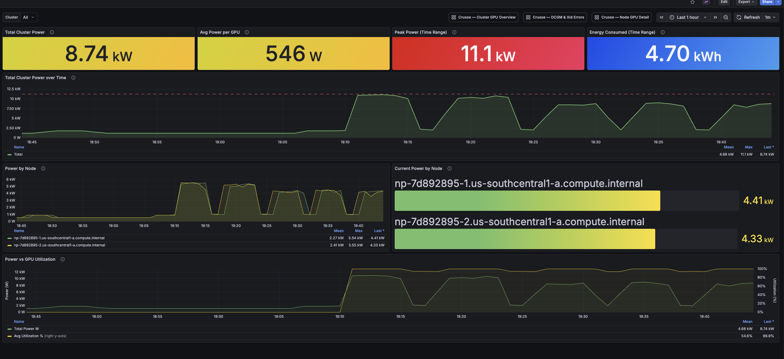

<!--
  Licensed under the terms of the parent repository. See the LICENSE file in
  the root of crusoecloud/solutions-library for details.
-->

# Self-hosted Grafana on Crusoe Managed Kubernetes



This solution deploys Grafana on a Crusoe Managed Kubernetes (CMK) cluster and configures it to pull GPU, node, and Slurm metrics from the Crusoe Telemetry Relay endpoint. You get a persistent Grafana instance you control, with pre-built dashboards for GPU utilization, per-node GPU detail, DCGM/Xid error tracking, GPU power, and InfiniBand fabric activity.

What this is: a self-managed Grafana deployment best suited for teams that want dedicated dashboards for CMK or Managed Slurm workloads. Support is best-effort. For fully managed observability, the metrics are also available in Crusoe Command Center without any setup.

What this is not: a full observability stack. Telemetry Relay currently exposes infrastructure and GPU metrics only — logs and distributed traces are not available through this endpoint. Sub-minute scrape intervals are not supported. See [Limitations](#limitations-and-next-steps) for details.

---

## Architecture

```
  CMK / Managed Slurm Cluster
  ┌────────────────────────────────────────────────────────┐
  │                                                        │
  │  ┌──────────┐     ┌───────────────────────────────┐   │
  │  │  Nodes   │────▶│  Crusoe Watch Agent (DaemonSet)│   │
  │  └──────────┘     └───────────────┬───────────────┘   │
  └───────────────────────────────────┼────────────────────┘
                                      │ collects metrics
                                      ▼
                        ┌─────────────────────────┐
                        │  Crusoe Metrics Backend  │
                        │  (30-day retention)      │
                        └────────────┬────────────┘
                                     │
                                     │ Prometheus-compatible query API
                                     ▼
                        ┌────────────────────────────────────┐
                        │  Telemetry Relay Endpoint          │
                        │  api.crusoecloud.com/v1alpha5/...  │
                        │  .../metrics/timeseries            │
                        └────────────┬───────────────────────┘
                                     │ Bearer token, PromQL
                                     │
  monitoring namespace (CMK)         │
  ┌───────────────────────────────── ▼ ──────────────────────┐
  │                                                           │
  │  ┌──────────────────┐   ┌──────────────────────────────┐  │
  │  │  Grafana (Helm)  │◀──│  Sidecar-watched resources   │  │
  │  │  + sidecars      │   │  - Secret: datasource YAML  │  │
  │  │  + PVC storage   │   │  - ConfigMap: dashboards    │  │
  │  └────────┬─────────┘   └──────────────────────────────┘  │
  │           │                                               │
  │  ┌────────▼─────────┐                                    │
  │  │  grafana-lb Svc  │                                    │
  │  │  (LoadBalancer)  │                                    │
  └──┴────────┬─────────┴────────────────────────────────────┘
              │ :3000
              ▼
         User Browser
```

---

## Prerequisites

- A running CMK cluster. Verify you can reach it:
  ```bash
  kubectl get nodes
  ```
- `helm` (v3 or v4) installed:
  ```bash
  helm version
  ```
- `crusoe` CLI installed and authenticated:
  ```bash
  crusoe projects list
  ```
- `envsubst` (from GNU `gettext`) — used in Step 3 to expand the datasource template:
  ```bash
  # macOS:  brew install gettext
  # Debian/Ubuntu: apt-get install -y gettext-base
  envsubst --version
  ```
- `python3` — used in Step 5 to re-save the datasource (one-time post-install workaround for a Grafana 12.3.x quirk):
  ```bash
  python3 --version
  ```
- **Telemetry Relay enabled on your project.** This feature is currently in limited availability — contact your Crusoe account team to request enablement before proceeding.
- **Crusoe Watch Agent installed on the cluster.** The Watch Agent collects infrastructure and DCGM metrics and forwards them to the Telemetry Relay backend. It is installed by default on Managed Slurm clusters. For CMK clusters, verify with your account team or check for the agent DaemonSet:
  ```bash
  kubectl get daemonset -A | grep -i watch
  ```

  > **Note:** The Watch Agent already provides DCGM metrics. If your cluster also runs `nvidia-dcgm-exporter` from the NVIDIA GPU Operator (the default on GPU CMK clusters), you will see some metric series reported twice — usually harmless for the dashboards in this repo, but worth knowing if you build alerts against a counter and see double the expected rate. To deduplicate, configure the Watch Agent to exclude DCGM or scope the exporter scrape with a `relabel_config` drop.

---

## Step 1: Generate the monitoring token

Get your project ID:

```bash
crusoe projects list
```

Note the `ID` column value for the project you want to monitor. Then create a monitoring token:

```bash
crusoe monitoring tokens create
```

**Copy the token immediately.** It is shown only once and cannot be retrieved afterward.

---

## Step 2: Create the namespace and secret

Apply the namespace:

```bash
kubectl apply -f manifests/namespace.yaml
```

Copy the secret example and fill in your values:

```bash
cp manifests/monitoring-token-secret.yaml.example manifests/monitoring-token-secret.yaml
```

Edit `manifests/monitoring-token-secret.yaml` and replace the placeholder values:

```yaml
stringData:
  MONITORING_TOKEN: "<paste your monitoring token here>"
  PROJECT_ID: "<paste your project ID here>"
```

Apply the secret:

```bash
kubectl apply -f manifests/monitoring-token-secret.yaml
```

> `monitoring-token-secret.yaml` is listed in `.gitignore` — do not commit it. Use the `.example` file as the committed template.

---

## Step 3: Apply the remaining manifests and install Grafana

Apply the StorageClass (if not already present), the PVC, and the dashboards ConfigMap:

```bash
kubectl apply -f manifests/ssd-storageclass.yaml
kubectl apply -f manifests/grafana-pvc.yaml
kubectl apply -f manifests/grafana-dashboards-configmap.yaml
```

Create the datasource Secret. The `grafana-datasource-secret.yaml.example` template contains
`${MONITORING_TOKEN}` and `${PROJECT_ID}` placeholders that must be expanded *before* the manifest
is applied — Grafana does not expand environment variables in `secureJsonData` provisioning fields.
Use `envsubst` to pre-expand and apply in one step:

```bash
export MONITORING_TOKEN=<your-monitoring-token>
export PROJECT_ID=<your-project-id>
envsubst < manifests/grafana-datasource-secret.yaml.example | kubectl apply -f -
```

> The expanded file (`manifests/grafana-datasource-secret.yaml`) is listed in `.gitignore`.
> Never commit a file with the real token embedded.

Add the Grafana Helm repository and install:

```bash
helm repo add grafana https://grafana.github.io/helm-charts
helm repo update

helm install grafana grafana/grafana \
  --namespace monitoring \
  --values manifests/grafana-values.yaml
```

What `grafana-values.yaml` configures:

| Setting | Value | Why |
|---|---|---|
| `persistence.existingClaim` | `grafana-storage` | Uses the PVC created above; data survives pod restarts |
| `sidecar.datasources.enabled` | `true` | Watches ConfigMaps and Secrets labeled `grafana_datasource=1` and auto-provisions them |
| `sidecar.dashboards.enabled` | `true` | Watches ConfigMaps labeled `grafana_dashboard=1` and loads them into Grafana |
| `sidecar.dashboards.provider.folder` | `Crusoe` | Puts provisioned dashboards in a "Crusoe" folder in the Grafana UI |
| `service.type` | `ClusterIP` | External access handled separately by `grafana-service-lb.yaml` |

Wait for the pod to be ready:

```bash
kubectl rollout status deployment/grafana -n monitoring
```

---

## Step 4: Expose via LoadBalancer

Apply the LoadBalancer service:

```bash
kubectl apply -f manifests/grafana-service-lb.yaml
```

Wait for an external IP to be assigned (this can take 1–2 minutes on Crusoe):

```bash
kubectl get svc grafana-lb -n monitoring -w
```

Once `EXTERNAL-IP` shows an IP address, Grafana is accessible at `http://<EXTERNAL-IP>:3000`.

> **Why port 3000 and not 80?** The Grafana Helm chart's ClusterIP service ends up on port 3000 on Crusoe Managed Kubernetes regardless of the `service.port` value passed in `grafana-values.yaml`, so this repo's `grafana-service-lb.yaml` exposes 3000 to match. If you need port 80 externally, add an ingress controller (recommended for production anyway).

> **Security warning:** This service exposes Grafana directly to the public internet on port 3000 with no TLS. For production use, add an ingress controller with TLS termination and an authentication proxy (e.g. [oauth2-proxy](https://oauth2-proxy.github.io/oauth2-proxy/)). At minimum, restrict the LoadBalancer source ranges in `grafana-service-lb.yaml` to your IP range:
> ```yaml
> spec:
>   loadBalancerSourceRanges:
>     - "203.0.113.0/24"   # replace with your CIDR
> ```
>
> For a quick local test without a public IP, skip the LoadBalancer and use port-forward instead:
> ```bash
> kubectl port-forward -n monitoring svc/grafana 3000:3000
> # Then open http://localhost:3000
> ```

---

## Step 5: Log in and verify

Retrieve the auto-generated admin password:

```bash
kubectl get secret --namespace monitoring grafana \
  -o jsonpath="{.data.admin-password}" | base64 --decode; echo
```

Log in at `http://<EXTERNAL-IP>:3000` (or `http://localhost:3000` if using port-forward) with username `admin` and the password above. Change the password after first login.

Re-save the datasource (one-time, required on Grafana 12.3.x):

```bash
TOKEN=$(kubectl get secret crusoe-monitoring-token -n monitoring \
  -o jsonpath='{.data.MONITORING_TOKEN}' | base64 -d)
ADMIN_PW=$(kubectl get secret -n monitoring grafana \
  -o jsonpath='{.data.admin-password}' | base64 -d)

CURRENT=$(kubectl exec -n monitoring deployment/grafana -c grafana -- \
  curl -sS -u "admin:$ADMIN_PW" http://localhost:3000/api/datasources/uid/crusoe-telemetry)

PAYLOAD=$(echo "$CURRENT" | TOKEN="$TOKEN" python3 -c "
import json, sys, os
d = json.loads(sys.stdin.read())
d['secureJsonData'] = {'httpHeaderValue1': 'Bearer ' + os.environ['TOKEN']}
print(json.dumps(d))")

kubectl exec -n monitoring deployment/grafana -c grafana -- env PAYLOAD="$PAYLOAD" \
  sh -c "curl -sS -X PUT -u admin:$ADMIN_PW -H 'Content-Type: application/json' \
  -d \"\$PAYLOAD\" http://localhost:3000/api/datasources/uid/crusoe-telemetry"

unset TOKEN ADMIN_PW CURRENT PAYLOAD
```

This re-encrypts the Bearer token in `secureJsonData` against Grafana's live encryption key. Sidecar-provisioned `secureJsonData` is sometimes not honored on first boot in Grafana 12.3.x — see [Troubleshooting](#troubleshooting) for symptoms.

Verify the data source:

1. Click **Connections** → **Data sources** in the left sidebar.
2. Click **Crusoe Telemetry Relay**.
3. Scroll to the bottom and click **Save & test**.
4. You should see a green banner: *"Successfully queried the Prometheus API."*

> The Grafana **Save & test** button calls `/api/v1/status/buildinfo`, which the Crusoe Telemetry Relay does not implement. It returns 401 regardless of token validity. The real test is whether the dashboards display data below.

If the test fails, see [Troubleshooting](#troubleshooting).

Verify the dashboards:

1. Click **Dashboards** in the left sidebar.
2. Open the **Crusoe** folder.
3. You should see six dashboards: Cluster GPU Overview, Node GPU Detail, DCGM & Xid Errors, Cluster GPU Power, InfiniBand Cluster View, and InfiniBand Node View.

---

## Dashboards included

All dashboards live in the `Crusoe` folder in Grafana and share a **Cluster** dropdown (populated from `cluster_id`). The per-node dashboards add a **Node** dropdown for drilling in.

### GPU dashboards

**Cluster GPU Overview (`cluster-gpu-overview.json`)** — cluster-wide GPU health and utilization. Total GPUs / nodes, average utilization gauge with 70%/90% thresholds, per-node utilization time series, memory used vs total, power draw by node, top-10 nodes by utilization.

**Node GPU Detail (`node-gpu-detail.json`)** — per-GPU breakdown for one node. Utilization per device, memory used, temperature with 75 °C / 85 °C thresholds, power draw, and SM/memory clocks (useful for spotting thermal throttling).

**Cluster GPU Power (`cluster-gpu-power.json`)** — aggregate and per-node power draw across the cluster, plus per-GPU power distribution histogram.

**DCGM & Xid Errors (`dcgm-xid-errors.json`)** — Xid + ECC tracking. Stat panels that turn red on any non-zero value, error rate by node over time, breakdown table by node / GPU / Xid code, and a DCGM health table for double-bit ECC and thermal violations. Xid code meanings: [NVIDIA's Xid error reference](https://docs.nvidia.com/deploy/xid-errors/).

> **Note on the `xid_id` label:** Panels that break down errors by Xid code use `sum by (node, gpu, xid_id)`. This label name is confirmed on Managed Slurm clusters. If the table shows no rows, verify the label name with the discovery curl in the Troubleshooting section.

### InfiniBand dashboards

**InfiniBand Cluster View (`cluster-ib-overview.json`)** — fabric activity across the cluster. Active IB nodes / total HCA ports, aggregate RX / TX bandwidth, per-node aggregate bandwidth time series, per-node RX utilization %, and per-node error / TX-wait rates.

**InfiniBand Node View (`node-ib-detail.json`)** — per-HCA detail for selected nodes (multi-select). Aggregate RX / TX per node, then a row of per-HCA RX / TX bandwidth, per-HCA RX / TX utilization %, and per-HCA RX errors + TX-wait.

> **IB dashboard caveats (read before relying on absolute Gbps):**
>
> On Crusoe-virtualized HCAs the IB port counters surfaced through Telemetry Relay are not a faithful realtime view of the fabric. Two issues we have observed:
>
> 1. **Sparse counter updates.** The agent appears to refresh the IB byte counters roughly every ~270 seconds even though the metric is scraped every 60s. Most `rate(...[1m])` windows therefore see no movement and return `NaN`, leaving panels blank for stretches of an otherwise busy job.
> 2. **Magnitude is low.** Counter deltas captured during a sustained `perftest` run measured ~10× lower than the actual bandwidth `perftest` reported on the same wire. The `line_rate` label (`gig_bit_per_sec`) also reports `128` on HCAs whose `ibstat` rate is `400`, so the utilization-% panels are calibrated against the wrong denominator.
>
> Treat the IB dashboards as **diagnostic** (which HCAs are active, where errors are concentrated, when traffic stops) rather than **quantitative** (absolute Gbps / % of line rate). For ground-truth bandwidth measurements, run `perftest` from inside the workload — `ibv_devinfo`, `perfquery`, and the standard `/sys/class/infiniband/.../counters/` files are not exposed inside Crusoe guest VMs, so there is no in-guest path to scrape accurate per-HCA counters today.

---

## Troubleshooting

### "Save & test" button returns 401 Unauthorized

**This is expected and not an error.** The Grafana datasource "Save & test" button calls `/api/v1/status/buildinfo`, which the Crusoe Telemetry Relay does not implement. It returns 401 regardless of whether your token is valid. **Do not regenerate your token based on this 401 alone.**

To verify the datasource actually works, open the **Crusoe** folder under **Dashboards** and check whether panels display data. If they do, the datasource is fine.

### Dashboards return 401 / "Authentication to data source failed" on every panel

This is the real failure mode. The token is genuinely not authenticating. Two common causes:

**a. The Grafana 12.3.x secureJsonData quirk.** See [the dedicated section below](#dashboard-panels-show-authentication-to-data-source-failed-401-even-though-the-token-is-valid). If you skipped the Step 5 re-save, run it now.

**b. The token is expired or scoped to a different project.** Verify the project ID matches:

```bash
crusoe projects list
# compare to:
kubectl get secret crusoe-monitoring-token -n monitoring \
  -o jsonpath='{.data.PROJECT_ID}' | base64 -d; echo
```

If the project is right but you suspect token expiry, regenerate and re-apply:

```bash
crusoe monitoring tokens create
```

1. Edit `manifests/monitoring-token-secret.yaml` locally and replace `MONITORING_TOKEN` with the new value (the file uses `stringData`, so paste the raw token — no base64 required).
2. Re-apply the secret:
   ```bash
   kubectl apply -f manifests/monitoring-token-secret.yaml
   ```
3. Re-run the [Step 5 re-save block](#step-5-log-in-and-verify) to push the new token into Grafana's `secureJsonData` (the sidecar does not automatically update `secureJsonData` when only the underlying token Secret changes).

### Dashboard panels show "Authentication to data source failed" / 401 even though the token is valid

Symptom: every dashboard panel returns `Authentication to data source failed` and Grafana logs show
`"code":"bad_credential"` from the upstream, but `curl -H "Authorization: Bearer <token>" <crusoe-url>`
from your laptop (or from inside the Grafana pod) succeeds. The Grafana API shows
`secureJsonFields.httpHeaderValue1: true`, suggesting the encrypted header value is stored — yet it
isn't being honored on outgoing requests.

This is a Grafana 12.3.x quirk with sidecar-provisioned `secureJsonData`: the encrypted Bearer
header sometimes isn't applied to the outgoing HTTP client on first boot. The reliable fix is to
re-save the datasource via the API, which re-encrypts the secure field against Grafana's live
encryption key and persists across pod restarts.

```bash
TOKEN=$(kubectl get secret crusoe-monitoring-token -n monitoring \
  -o jsonpath='{.data.MONITORING_TOKEN}' | base64 -d)
ADMIN_PW=$(kubectl get secret -n monitoring grafana \
  -o jsonpath='{.data.admin-password}' | base64 -d)

CURRENT=$(kubectl exec -n monitoring deployment/grafana -c grafana -- \
  curl -sS -u "admin:$ADMIN_PW" http://localhost:3000/api/datasources/uid/crusoe-telemetry)

PAYLOAD=$(echo "$CURRENT" | TOKEN="$TOKEN" python3 -c "
import json, sys, os
d = json.loads(sys.stdin.read())
d['secureJsonData'] = {'httpHeaderValue1': 'Bearer ' + os.environ['TOKEN']}
print(json.dumps(d))")

kubectl exec -n monitoring deployment/grafana -c grafana -- env PAYLOAD="$PAYLOAD" \
  sh -c "curl -sS -X PUT -u admin:$ADMIN_PW -H 'Content-Type: application/json' \
  -d \"\$PAYLOAD\" http://localhost:3000/api/datasources/uid/crusoe-telemetry"

unset TOKEN ADMIN_PW CURRENT PAYLOAD
```

This requires `editable: true` on the datasource (the default in
`grafana-datasource-secret.yaml.example`). Re-test by reloading a dashboard — panels should now
populate.

### Dashboards render but every panel says "No data"

The datasource is reaching Crusoe (no 401), but no metrics come back. Common causes:

- **Watch Agent not installed.** If no Watch Agent is running on the cluster, no metrics reach the Telemetry Relay backend. Check with your Crusoe account team.
- **Telemetry Relay not enabled.** Even with the Watch Agent, the scrape endpoint must be enabled per-project. Contact your account team if the endpoint returns 404 or empty results.
- **Scrape interval.** The minimum is 60 seconds. If you see "No data" on short time ranges (e.g., last 5 minutes), widen the time range to at least last 1 hour.
- **cluster_id label not present on GPU metrics.** The `$cluster` variable in the Cluster GPU Overview dashboard uses `label_values(DCGM_FI_DEV_GPU_UTIL, cluster_id)`. If this label is absent from GPU metrics (it is confirmed on Slurm metrics), the variable will be empty and the `{cluster_id=~"$cluster"}` filter will match nothing. In that case, remove the filter from the affected panel queries.

### Dashboard variables are empty or panels show no data

Discover the available metric names and label names by querying the API directly:

```bash
TOKEN=$(kubectl get secret crusoe-monitoring-token -n monitoring \
  -o jsonpath='{.data.MONITORING_TOKEN}' | base64 -d)
PROJECT=$(kubectl get secret crusoe-monitoring-token -n monitoring \
  -o jsonpath='{.data.PROJECT_ID}' | base64 -d)

# List available DCGM metric names
curl -s -G "https://api.crusoecloud.com/v1alpha5/projects/${PROJECT}/metrics/timeseries" \
  -H "Authorization: Bearer ${TOKEN}" \
  --data-urlencode 'query=DCGM_FI_DEV_GPU_UTIL' \
  | python3 -c "import sys,json; d=json.load(sys.stdin); [print(r['metric']) for r in d.get('data',{}).get('result',[])]"
```

If metric names differ from what the dashboards expect, update the `expr` field in the relevant panels (or the corresponding JSON in `dashboards/`). After editing the JSON, regenerate the dashboards ConfigMap:

```bash
kubectl create configmap crusoe-dashboards \
  --namespace=monitoring \
  --from-file=cluster-gpu-overview.json=dashboards/cluster-gpu-overview.json \
  --from-file=node-gpu-detail.json=dashboards/node-gpu-detail.json \
  --from-file=dcgm-xid-errors.json=dashboards/dcgm-xid-errors.json \
  --from-file=cluster-gpu-power.json=dashboards/cluster-gpu-power.json \
  --from-file=cluster-ib-overview.json=dashboards/cluster-ib-overview.json \
  --from-file=node-ib-detail.json=dashboards/node-ib-detail.json \
  --dry-run=client -o yaml \
  | sed 's/^metadata:$/metadata:\n  labels:\n    grafana_dashboard: "1"/' \
  | kubectl apply -f -
```

The `grafana_dashboard: "1"` label is what the sidecar watches — without it, the sidecar will not pick up the ConfigMap. The sidecar reloads dashboards within a minute.

### LoadBalancer service stuck in `<pending>` for external IP

Crusoe LoadBalancer provisioning can take 2–3 minutes. If it remains pending longer, check your project's LB quota with your account team. As a workaround, use port-forward:

```bash
kubectl port-forward -n monitoring svc/grafana 3000:3000
# Then open http://localhost:3000
```

### PVC stuck in `Pending`

Run these to diagnose:

```bash
kubectl get storageclass
kubectl get events -n monitoring --sort-by='.lastTimestamp' | grep -i pvc
kubectl describe pvc grafana-storage -n monitoring
```

**StorageClass `crusoe-csi-driver-ssd-sc` not found:** Apply `manifests/ssd-storageclass.yaml` first — the PVC references that class by name. If your cluster already has an equivalent SSD class, edit `storageClassName` in `manifests/grafana-pvc.yaml` to match instead.

**`no storage class is set` despite a default existing:** Delete the PVC and ensure `storageClassName` is explicitly set in `grafana-pvc.yaml` (not left blank or commented out), then re-apply.

**PVC stuck at `Pending` with `WaitForFirstConsumer`:** This is expected before the Grafana pod is scheduled — the SSD CSI driver uses `volumeBindingMode: WaitForFirstConsumer`, so volume creation is deferred until a pod consumes the PVC. Once `helm install grafana` schedules the pod, the PVC will bind.

---

## Validating the dashboards with a real workload

After deploying Grafana, the easiest way to confirm the GPU dashboards are wired correctly is to run a sustained multi-node training job and watch the panels populate.

> **Slurm cluster required for this section.** The [`examples/slurm-gpu-burn/`](examples/slurm-gpu-burn/) benchmark below is launched via `sbatch`, which assumes a Crusoe Managed Slurm cluster (or Slurm-on-CMK with Pyxis/enroot). On a plain CMK cluster without Slurm, drive the GPU dashboards with any GPU workload you already have — a long-running `kubectl run` of `nvcr.io/nvidia/pytorch:25.01-py3` running a synthetic matmul loop produces the same SM-utilization / memory / power signals.

The `examples/slurm-gpu-burn/` example is a zero-dependency two-node H100 synthetic training benchmark — no HuggingFace tokens, no dataset download, no `pip install`. It runs ~10–20 minutes and produces sustained DCGM metrics across SM utilization, memory, NVLink, IB, power, and temperature. See its own [README](examples/slurm-gpu-burn/README.md) for usage.

```bash
# From the Slurm login node, after copying train.py + train.sbatch to your home directory:
sbatch train.sbatch
```

---

## Cleanup

```bash
helm uninstall grafana --namespace monitoring
kubectl delete namespace monitoring
```

This removes Grafana and all resources in the `monitoring` namespace including the PVC. Grafana data (dashboards customized in-browser, alert rules) will be lost.

---

## Limitations and next steps

- **Minimum query interval is 60 seconds.** The Crusoe Telemetry Relay collects metrics every 60 seconds; querying more frequently returns the same data.
- **30-day metric retention** on the Crusoe backend. For longer retention, add a Prometheus instance that remote-writes from the Telemetry Relay into your own Thanos or Mimir.
- **Metrics only.** Logs and distributed traces are not available via Telemetry Relay. For log aggregation on CMK, see the [CMK logs to GCP](../crusoe-managed-kubernetes-logs-to-gcp) solution in this repository.
- **Label names.** Dashboards use the `node` label to identify nodes and the `gpu` label for GPU index. These are confirmed correct for Crusoe Telemetry Relay on Managed Slurm clusters. If variable dropdowns appear empty on a different cluster type, run the discovery curl in the Troubleshooting section to confirm the actual label names.
- **Slurm metrics.** `slurm_*` metrics from Managed Slurm clusters (e.g. `slurm_queue_length{cluster_id="..."}`) are available via the same endpoint. Add panels for job queue depth, node state, and wait time as needed.
- **Production hardening.** Before exposing this to a team, add TLS via cert-manager + ingress, configure LDAP or SSO in `grafana.ini`, and set `allowUiUpdates: false` on the dashboard provider (already set in `grafana-values.yaml`) to prevent in-browser changes from being overwritten on pod restart.
