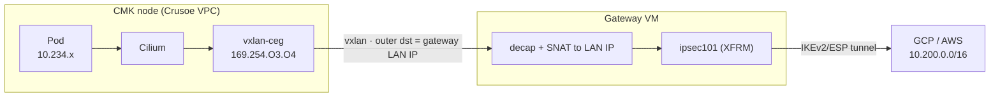

# Routing Crusoe cluster / multi-VM traffic through the gateway VM

This feature lets other Crusoe hosts — including CMK (Kubernetes) pods — send
traffic through the standalone VPN gateway VM to the remote peer (GCP or AWS).
This document covers the platform constraint that requires it, how to deploy
it, and its trade-offs.

## The platform constraint (Crusoe VPC)

A Crusoe VM only receives packets whose **destination IP is its own**. A bare
IP packet addressed to a remote CIDR (e.g. `10.200.0.2`) with the gateway VM as
next-hop is dropped by the fabric before it reaches the VM — only frames whose
outer destination is that VM's own IP are delivered. There is no user-managed
VPC route table and no "disable source/dest check" / "can-IP-forward" flag in
the Crusoe CLI or Terraform provider.

Consequence: a Crusoe VM **cannot act as a plain L3 transit router** for other
VMs. The gateway carries its *own* traffic through the tunnel; forwarding
*other hosts'* traffic requires encapsulation so the fabric only ever sees
VM-to-VM frames (outer destination = real node IP).

## Architecture: node→gateway overlay + SNAT

Three requirements for a working deployment:

1. **Encapsulate the host→gateway hop.** Build a point-to-point overlay
   (vxlan/GENEVE/IPIP/WireGuard) from each host to the gateway VM's internal IP.
   The outer destination is the gateway VM itself, so the fabric delivers it.
   Route the remote CIDR into that overlay on the host.

2. **Open the gateway's host firewall for the overlay.** The gateway's
   `nftables` input chain is default-deny; add an allow for the overlay
   transport (e.g. `udp dport 4789` for vxlan) from the Crusoe VPC CIDR.
   Without this rule the kernel drops the encapsulated packet before
   decapsulating it.

3. **SNAT on the gateway to an advertised, peer-allowed source.** After decap,
   masquerade/SNAT the inner traffic to the gateway's **LAN IP** (which is
   inside `crusoe_vpc_cidrs` and advertised via BGP). Do **not** let it egress
   with the overlay link-local or the tunnel `/30` source — the peer's firewall
   only accepts the advertised CIDR and would drop it, and return routing would
   fail. With SNAT to the LAN IP, the peer accepts the traffic and returns it
   through the tunnel to the gateway, which un-SNATs and sends it back over the
   overlay.

### Performance characteristics

- CMK pod → GCP: ICMP 0% loss (~130 ms iceland↔us-east4 typical), 20 MB HTTP
  transfer completes (HTTP 200).
- Node hostNetwork → GCP: ~92 Mbit/s single-stream over the double-encapsulated
  path.

**Planned:** WireGuard overlay transport (encrypts the intra-VPC hop); full
per-pod source identity (advertise pod CIDRs + per-node BGP). These are render-validated but not yet live.
