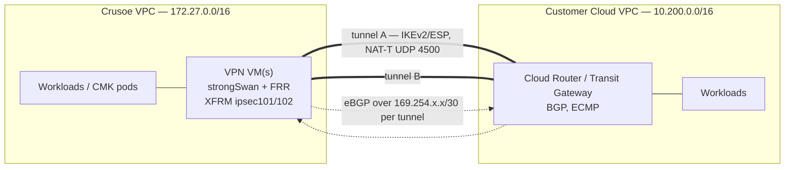
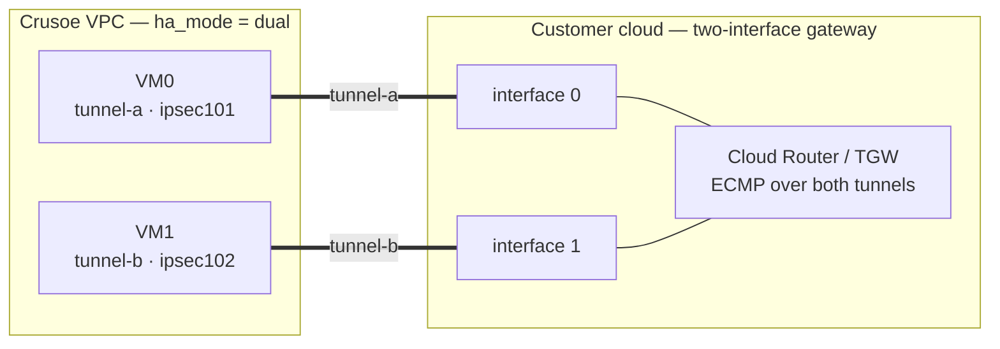

# Architecture

Hardened, route-based IPsec (IKEv2) site-to-site VPN terminating on one or two
Crusoe VMs, with BGP (FRR) for dynamic routing and automatic tunnel failover.
The customer side is AWS Site-to-Site VPN or GCP HA VPN — both managed
gateways collapse onto the same tunnel abstraction on our side.

## Topology



Both cloud gateways collapse onto the same "list of two tunnels" abstraction on
the Crusoe side — see [The tunnel object model](#the-tunnel-object-model).

Components on each Crusoe VPN VM (Ubuntu 24.04 LTS):

| Component | Role |
|---|---|
| strongSwan (charon-systemd + `swanctl`) | IKEv2 negotiation, ESP encryption, DPD, rekey |
| XFRM interfaces (`ipsec101`, `ipsec102`, …) | Route-based tunnel netdevs, one per tunnel, keyed by `if_id` |
| FRR (`bgpd` + `zebra`) | eBGP over the per-tunnel link-local /30s; prefix filters; ECMP |
| nftables | Default-deny input, UDP 500/4500 from peers only, SSH allow-list, BGP only over tunnel interfaces, MSS clamp on forwarded TCP |
| sysctls (`/etc/sysctl.d/99-vpn.conf`) | IP forwarding on, loose rp_filter (asymmetric two-tunnel paths), ICMP redirects off |

## Design rationale

### Route-based (XFRM) over policy-based IPsec

Policy-based IPsec encodes "what traffic goes into the tunnel" in the IKE
traffic selectors. Every CIDR change means renegotiating CHILD_SAs, and
failover means SA churn. Route-based IPsec instead sets traffic selectors to
`0.0.0.0/0 <-> 0.0.0.0/0` and lets the **routing table decide** what enters
each tunnel:

- **BGP owns reachability.** Prefixes learned/advertised over BGP steer
  traffic into the right XFRM interface. Adding or removing a CIDR is a
  routing update, not an IPsec renegotiation.
- **Failover is a routing event.** When tunnel A dies (DPD or BGP hold
  timer), FRR withdraws routes via A and traffic shifts to tunnel B's
  interface. No traffic-selector churn, no SA re-scoping.
- **ECMP for free.** With both tunnels up, FRR `maximum-paths` load-shares
  across the two XFRM interfaces.

Each connection in `swanctl.conf` sets `if_id_in`/`if_id_out` to the tunnel's
`xfrm_if_id`, binding its SAs to a dedicated `ipsec<if_id>` netdev created by
`ip link add ipsecN type xfrm dev <wan> if_id N` (see
`terraform/crusoe/templates/xfrm-interfaces.sh.tftpl`, persisted via a systemd
oneshot unit `vpn-xfrm.service` that runs before strongSwan and FRR).

### NAT-T assumed (UDP 4500 only)

The Crusoe firewall model in this module allows **UDP 500 and 4500 from each
peer IP** and nothing else. strongSwan is configured with `encap = yes`, which
forces UDP encapsulation of ESP (NAT-T) even when no NAT is detected. Both AWS
and GCP managed gateways support this. The upside: no raw ESP (IP proto 50)
rule is needed, and the configuration behaves identically whether or not
something on the path NATs. If you disable NAT-T you must add an ESP protocol
allow rule yourself — not covered by this module.

### Single vs dual HA

| | `ha_mode = "single"` | `ha_mode = "dual"` |
|---|---|---|
| Crusoe VMs | 1 (terminates both tunnels) | 2, across placements (each terminates its tunnels per `vm_index`) |
| Tunnel redundancy | Yes — both cloud-side tunnels are up | Yes |
| VM redundancy | **No — the VM is a SPOF** | Yes — surviving VM keeps its tunnel up |
| GCP mapping | 1-interface external VPN gateway (`SINGLE_IP_INTERNALLY_REDUNDANT`) | 2-interface external gateway (`TWO_IPS_REDUNDANCY`) |
| AWS mapping | 1 Customer Gateway, 1 S2S VPN connection | 2 CGWs (one per VM), TGW with ECMP |
| Cost | 1 VM + 1 public IP | 2 VMs + 2 public IPs |
| Recommended for | dev/test, quickstart | production |

The tunnel list abstraction is identical in both modes; only `vm_index`
assignments and the VM count change. A Terraform precondition rejects
`vm_index` values that exceed the VM count and VMs with zero tunnels.



Stopping one VM withdraws its BGP routes; the peer reconverges onto the
surviving VM's tunnel within the BGP hold time.

### VTI fallback (pre-4.19 kernels)

XFRM interfaces require Linux >= 4.19. Ubuntu 24.04 (kernel 6.8+) is far past
that, so this repo uses XFRM exclusively. If you ever port this to an older
kernel, the fallback is VTI (`ip tunnel add ... mode vti key <mark>`) with
`mark`-based SA binding instead of `if_id`. VTI is functionally similar but
requires disabling policy lookups (`disable_policy`) and has quirks around
IPv6 and GRE; do not use it unless you must.

## The tunnel object model

Everything on the Crusoe side is generated from one list, `var.tunnels`
(defined in `terraform/crusoe/variables.tf`, filled in
`params/params.tfvars`):

```hcl
{
  name            = "tunnel-a"          # swanctl connection + BGP neighbor description
  peer_public_ip  = "203.0.113.10"      # customer gateway endpoint; also its IKE identity
  psk_var_name    = "PSK_TUNNEL_A"      # KEY into var.tunnel_psks — never the PSK itself
  xfrm_if_id      = 101                 # unique; names the netdev ipsec101 and binds SAs
  bgp_local_ip    = "169.254.21.2"      # Crusoe address on the inside /30
  bgp_remote_ip   = "169.254.21.1"      # customer BGP peer address
  bgp_inside_cidr = "169.254.21.0/30"   # the link /30 (unique per tunnel)
  remote_asn      = 64514               # customer-side ASN
  vm_index        = 0                   # which Crusoe VM terminates this tunnel
}
```

Per tunnel, Terraform renders:

1. a `connections.<name>` block in `swanctl.conf` (IKEv2 only, PSK auth,
   `start_action = trap`, `dpd_action = restart`, if_id wired);
2. a secrets stanza in `tunnels.secrets.conf` (mode 0600) resolving
   `psk_var_name` against `var.tunnel_psks`;
3. an `ipsec<if_id>` XFRM interface with `tunnel_mtu` and `bgp_local_ip/30`;
4. an FRR `neighbor <bgp_remote_ip> remote-as <remote_asn>` with inbound
   (`CUSTOMER-IN`) and outbound (`CRUSOE-OUT`) prefix lists;
5. nftables rules: UDP 500/4500 from `peer_public_ip`, BGP (TCP 179) only on
   `ipsec<if_id>` from `bgp_remote_ip`, MSS clamp on the forward path;
6. a Crusoe firewall rule allowing UDP 500/4500 from `peer_public_ip/32` to
   the terminating VM.

AWS and GCP both collapse to "a list of length 2": GCP's two HA VPN interface
IPs, or AWS's two tunnel outside IPs, become the two `peer_public_ip` values.

## MTU / MSS

IPsec + NAT-T overhead silently breaks large packets (ping works, transfers
hang). XFRM interfaces get MTU `tunnel_mtu` (default 1400) and nftables clamps
TCP MSS on forwarded SYNs in **both** directions to `mss_clamp` (default
1360). See `docs/runbook.md` §Troubleshoot and `scripts/mtu-test.sh`.

## Observability

Logging, the pollable healthcheck (`/usr/local/sbin/vpn-healthcheck.sh`),
alert signals, and the metrics list are documented in
[docs/runbook.md — Observability](runbook.md#observability).
