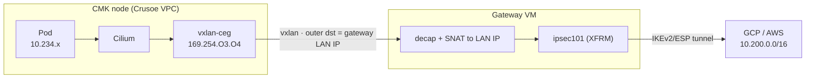

# Routing Crusoe cluster / multi-VM traffic through the gateway VM

This feature lets other Crusoe hosts — including CMK (Kubernetes) pods — send
traffic through the standalone VPN gateway VM to the remote peer (GCP or AWS).
This document covers the platform constraint that requires it, how to deploy
it, and its trade-offs.

## The platform constraint (Crusoe VPC)

A Crusoe VM only receives packets whose **destination IP is its own**. A bare
IP packet addressed to a remote CIDR (e.g. `10.200.0.2`) with the gateway VM as
next-hop is dropped by the fabric before it reaches the VM — only frames whose
outer destination is that VM's own IP are delivered. There is no user-managed
VPC route table and no "disable source/dest check" / "can-IP-forward" flag in
the Crusoe CLI or Terraform provider.

Consequence: a Crusoe VM **cannot act as a plain L3 transit router** for other
VMs. The gateway carries its *own* traffic through the tunnel; forwarding
*other hosts'* traffic requires encapsulation so the fabric only ever sees
VM-to-VM frames (outer destination = real node IP).

This is the same reason `ipsec-tunnel-cmk` runs strongSwan as pods and relies on
Cilium's vxlan: the encapsulated outer destination is always a real node IP.

## Architecture: node→gateway overlay + SNAT

Three requirements for a working deployment:

1. **Encapsulate the host→gateway hop.** Build a point-to-point overlay
   (vxlan/GENEVE/IPIP/WireGuard) from each host to the gateway VM's internal IP.
   The outer destination is the gateway VM itself, so the fabric delivers it.
   Route the remote CIDR into that overlay on the host.

2. **Open the gateway's host firewall for the overlay.** The gateway's
   `nftables` input chain is default-deny; add an allow for the overlay
   transport (e.g. `udp dport 4789` for vxlan) from the Crusoe VPC CIDR.
   Without this rule the kernel drops the encapsulated packet before
   decapsulating it.

3. **SNAT on the gateway to an advertised, peer-allowed source.** After decap,
   masquerade/SNAT the inner traffic to the gateway's **LAN IP** (which is
   inside `crusoe_vpc_cidrs` and advertised via BGP). Do **not** let it egress
   with the overlay link-local or the tunnel `/30` source — the peer's firewall
   only accepts the advertised CIDR and would drop it, and return routing would
   fail. With SNAT to the LAN IP, the peer accepts the traffic and returns it
   through the tunnel to the gateway, which un-SNATs and sends it back over the
   overlay.

### Performance characteristics

- CMK pod → GCP: ICMP 0% loss (~130 ms iceland↔us-east4 typical), 20 MB HTTP
  transfer completes (HTTP 200).
- Node hostNetwork → GCP: ~92 Mbit/s single-stream over the double-encapsulated
  path.

## Trade-offs vs. `ipsec-tunnel-cmk`

| | This (standalone gateway + overlay) | ipsec-tunnel-cmk (strongSwan as pods) |
|---|---|---|
| strongSwan / PSKs location | off the cluster, on a hardened VM | privileged pods inside the cluster |
| One gateway serves | multiple clusters + non-k8s VMs | one cluster |
| Extra overlay | yes (node→gateway) | no (reuses Cilium vxlan) |
| Per-pod source identity at peer | lost under SNAT (all traffic = gateway IP) | preserved (advertise pod CIDR) |
| Best when | you want the VPN isolated from workloads / shared | you want the simplest CMK-only path |

For a CMK-only deployment, `ipsec-tunnel-cmk` is simpler. Choose the standalone
gateway when you want the VPN termination isolated from the cluster (no
privileged pods, PSKs off the nodes) or shared across several clusters/VMs.

## Flags (all under `cluster_egress` in terraform/crusoe + Helm values)

| Flag | Values | Effect |
|---|---|---|
| `enabled` | bool | Turn the overlay hub on/off on the gateway (default off). |
| `snat_mode` | `gateway` \| `node` | `gateway`: SNAT overlay→gateway LAN IP; peer sees one source (this gateway). `node`: no SNAT, gateway advertises the overlay CIDR via BGP; peer sees each node's overlay IP (per-node identity). |
| `overlay_transport` | `vxlan` \| `wireguard` | `vxlan` implemented. `wireguard` reserved (encrypts the intra-VPC hop) — validation rejects it until implemented; the hop is within your isolated Crusoe VPC. |
| `vxlan_id` / `vxlan_port` | number | VNI / UDP transport port. |
| `overlay_cidr` | /16 | Overlay subnet; gateway = `<base>.0.1`, node = `<base>.<3rd>.<4th octet of node IP>`. |
| gateway sizing | `instance_type` | Throughput knob — the gateway is a shared crypto funnel; scale up, or use `ha_mode=dual`. |
| multi-gateway | Helm `gateways: [...]` | Nodes hash-spread across the gateway set for horizontal scale. |

## Resilience to node churn / node IP changes

The design is self-healing as long as the **gateway keeps a stable IP** (static
public IP; only a gateway *config change* replaces the VM and changes its IP —
that is the one event that requires updating the Helm `gateways` value and peer
config):

- **New node** — the DaemonSet schedules on it automatically and builds its
  own overlay from its own node IP. No manual action required.
- **Node removed** — the DaemonSet pod tears the overlay down; the gateway's
  learned entry ages out.
- **Node IP changes** — the pod restarts with the new host IP and reconfigures;
  its overlay IP and MAC are derived from the node IP, so all mappings follow.
- **No per-node gateway config, ever.** Each node's overlay interface gets a
  deterministic MAC `02:00:a9:fe:<O3>:<O4>` encoding its overlay IP
  `169.254.<O3>.<O4>`. The gateway learns `MAC→node-underlay` from inbound
  traffic and a reconcile loop turns each learned MAC into a permanent neighbor
  entry (`169.254.<O3>.<O4> → MAC`). Return traffic resolves without ARP
  flooding — a learning vxlan hub cannot flood without multicast, which the
  Crusoe fabric does not provide. The reconcile loop is what makes multi-node
  work and survive churn without manual intervention.
- **Overlap caveat:** overlay IPs collide only if two nodes share the last two
  octets of their VPC IP — rare within a /20; document or widen the overlay
  CIDR if needed.

## Status & roadmap

Deployment is fully automated and flag-driven: `terraform apply` (gateway with
`cluster_egress.enabled`) + `helm install cluster-egress` (nodes).

**Generally available:** vxlan overlay transport; `snat_mode=gateway` (all
cluster traffic appears to the peer as the gateway's LAN IP);
`snat_mode=node` (gateway advertises the overlay CIDR via BGP so each node's
overlay IP is visible to the peer — no SNAT).

**Planned:** WireGuard overlay transport (encrypts the intra-VPC hop); full
per-pod source identity (advertise pod CIDRs + per-node BGP, equivalent to
`ipsec-tunnel-cmk`). These are render-validated but not yet live.
